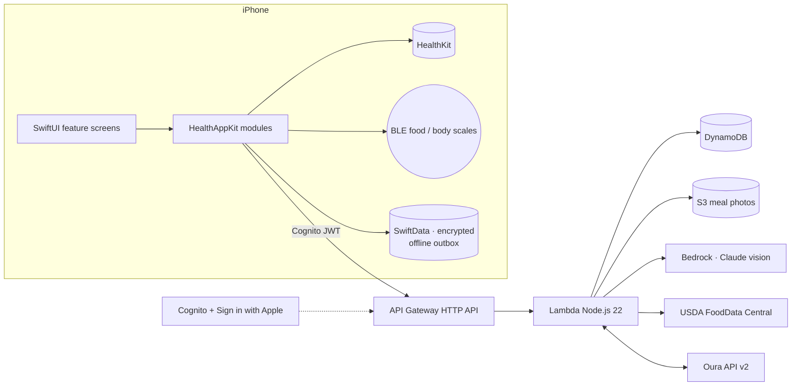

# HealthApp — Fuel · Train · Recover

A native iPhone app that unifies **Apple Health**, **Oura Ring**, **smart body scales**, **Bluetooth food scales**
and **AI food logging** into one dashboard. Fueling, training and recovery appear together on one screen,
so you don't have to switch between four apps or rely on a single "calories remaining" number.

```
healthapp/
├── docs/        Product architecture, schema, API, integrations, AI pipeline, wireframes, roadmap
├── backend/     AWS SAM: Cognito (Sign in with Apple) · API Gateway · Lambda (Node.js 22) · DynamoDB · S3 · KMS · Bedrock
└── ios/         SwiftUI app (iOS 17+) + HealthAppKit modular Swift package
```

## Start here

| # | Document |
|---|---|
| 1 | [Product architecture](docs/01-product-architecture.md) |
| 2 | [Database schema (DynamoDB)](docs/02-database-schema.md) |
| 3 | [API architecture](docs/03-api-architecture.md) |
| 4 | [HealthKit data model](docs/04-healthkit-data-model.md) |
| 5 | [Oura integration plan](docs/05-oura-integration-plan.md) |
| 6 | [Bluetooth food-scale & body-scale architecture](docs/06-food-scale-ble-architecture.md) |
| 7 | [AI meal-recognition pipeline](docs/07-ai-meal-recognition-pipeline.md) |
| 8 | [Screen-by-screen wireframes](docs/08-wireframes.md) |
| 9 | [SwiftUI project structure](docs/09-swiftui-project-structure.md) |
| 10 | [MVP plan & roadmap](docs/10-mvp-plan-and-roadmap.md) |
| 11 | [AWS infrastructure & security](docs/11-aws-infrastructure-and-security.md) |

## Architecture at a glance



## Design rules built into the code

* **Estimates are labelled as estimates.** Photo-based calories always show a low–high range. Weighed items use exact grams.
* **The AI identifies foods; the database supplies the nutrition.** Calories and macros come from USDA data × grams, not from model guesses.
* **No extreme-deficit encouragement.** When intake is very low relative to expenditure, the app shows a neutral recovery-and-fueling message.
* **The coach never diagnoses** and always separates correlation from causation.
* **You control each source.** Every source and metric can be switched on or off separately, and you can export or delete all your data.

## Quick start

* **Backend:** see [backend/README.md](backend/README.md) (`npm test`, `sam build && sam deploy --guided`).
* **iOS:** see [ios/README.md](ios/README.md) (`xcodegen` → open in Xcode 16 → run). The app starts in **demo mode** with 90 days of sample data, so every screen works in the Simulator before the backend is deployed.
