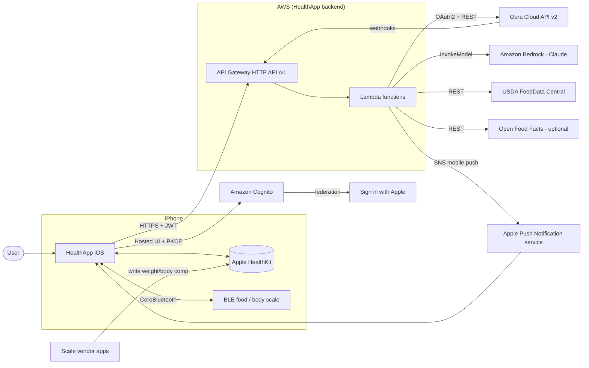
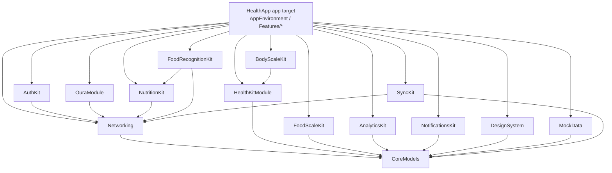
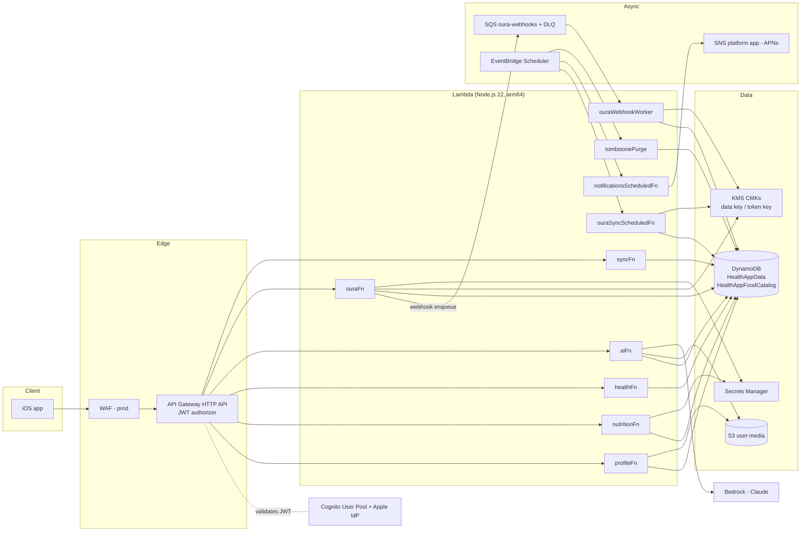
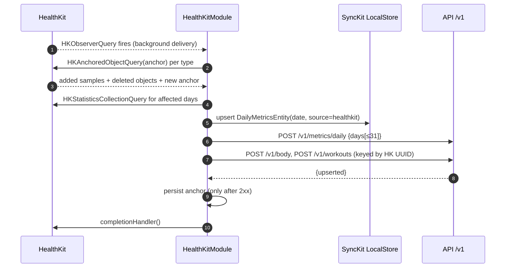
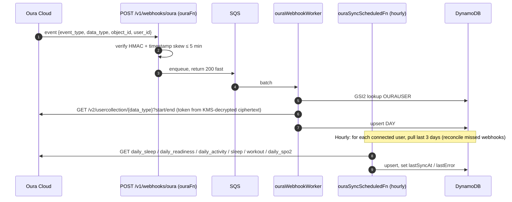
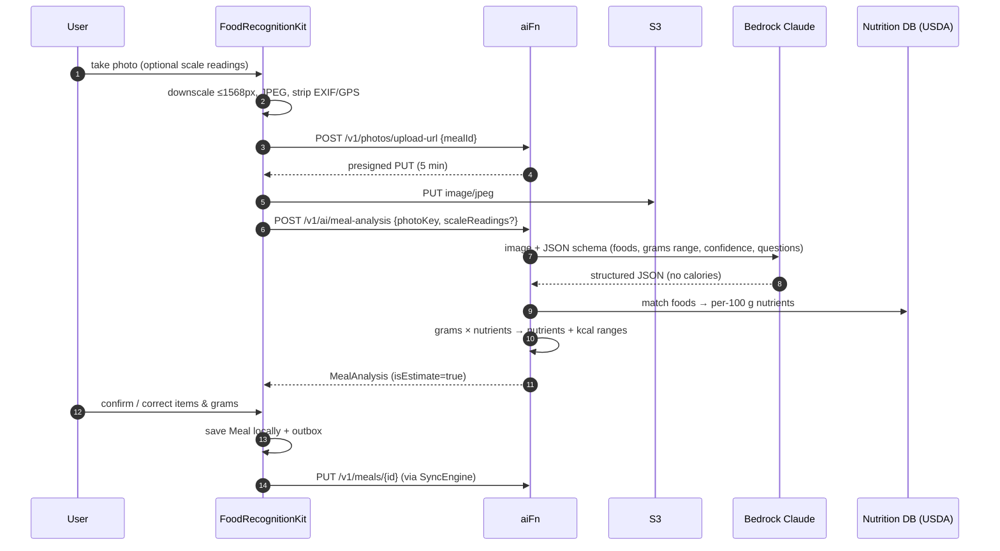
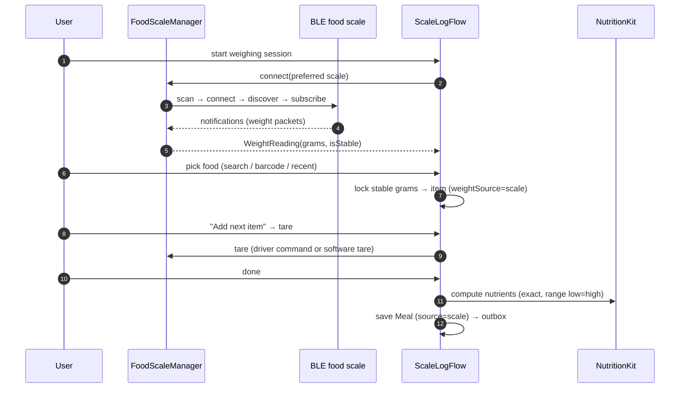
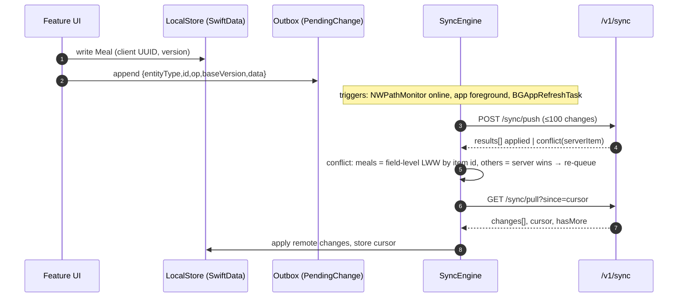

# 1 · Product Architecture

> HealthApp is a premium iPhone app that puts **fueling, training and recovery on one screen**.
> It unifies Apple Health, Oura Ring, smart body scales, Bluetooth food scales and AI food logging,
> and adds an AI coach that explains patterns without diagnosing anything.
>
> Binding contracts: [02 · Database schema](02-database-schema.md) and [03 · API architecture](03-api-architecture.md).
> This document describes the product and system around them; where they differ, 02/03 win.

---

## 1.1 Vision & principles

**Vision.** Answer one daily question honestly: *"Given how I slept, how I trained and what I've eaten, what does my body need today?"*

| # | Principle | What it means in practice |
|---|---|---|
| P1 | **Fuel + Train + Recover together** | No screen shows calories without context. Today combines intake, expenditure, training load and recovery signals in one card. |
| P2 | **Honest about estimates** | Every AI- or photo-derived number is labelled *Estimate* and shown as a range (`totalsRange`). Weighed items collapse to a single value. Wearable energy figures are labelled as device estimates. |
| P3 | **No extreme-deficit encouragement** | We never celebrate a large deficit, never show "streaks" for under-eating, and floor guidance at safe minimums (see §1.10). Goal mode `lose_gently` is the only weight-loss mode. |
| P4 | **Privacy by default** | Minimum data leaves the device; photos expire after 30 days; no ads, no data sale, no third-party analytics SDKs that receive health data. |
| P5 | **User chooses every source** | Each provider and each metric within it is an explicit toggle (`CONNECTION#<provider>.enabledMetrics[]`). Source precedence is user-editable. |
| P6 | **Works offline** | Logging never blocks on the network (outbox, §1.6.5). |
| P7 | **Explain, don't diagnose** | The coach and insights describe correlations with confidence and caveats; they never name conditions or prescribe treatment. |

## 1.2 Personas

| Persona | Context | Primary jobs | What would make them leave |
|---|---|---|---|
| **Maya, 34 — hybrid athlete** | Oura + Apple Watch, lifts 4×/wk, runs 2×/wk | "Am I eating enough on heavy days?" "Did my late dinner hurt my HRV?" | Diet-culture tone; numbers that don't reconcile across devices |
| **Dev, 41 — recomposition** | Smart body scale, desk job, wants to lose fat slowly | Track weight trend not daily noise; protein target; low-friction logging | Daily weight shaming; tedious food entry |
| **Lena, 28 — endurance / data nerd** | Oura, Garmin → Apple Health, Bluetooth food scale | Weighed, precise logging; correlations (carbs vs readiness) | Imprecise photo estimates presented as exact |
| **Sam, 52 — health-curious beginner** | iPhone only, later adds a scale | Simple "how am I doing" view; gentle reminders | Medical-sounding claims, information overload |

## 1.3 Feature map by tab

The tab bar has five tabs (Today, Food, Trends, Coach, More). Activity, Recovery and Body are reachable from Today cards and from **More**; Calendar and Settings live under **More** with a shortcut from Today's date header.

| Area | iOS feature folder | Key features | Backend |
|---|---|---|---|
| **Today** | `Features/Today` | Fuel · Train · Recover card, Daily Energy section, macro rings, metric cards (sleep, readiness, HRV, RHR, steps), today's workouts, hydration, neutral fueling message | `GET /v1/day/{date}` |
| **Food** | `Features/Food` | Food log by meal category; Add Food sheet (Photo, Scale, Barcode, Search, Voice, Saved, Restaurant, Custom); photo confirm with ranges; scale weighing; meal editor; recipes & saved meals; custom foods; food history | `/v1/meals*`, `/v1/foods*`, `/v1/recipes*`, `/v1/photos/upload-url`, `/v1/ai/meal-analysis`, `/v1/ai/voice-parse` |
| **Activity** | `Features/Activity` | Steps, active energy, workouts list & detail, training load (TRIMP), weekly volume | `/v1/metrics/daily`, `/v1/workouts` |
| **Recovery** | `Features/Recovery` | Sleep score & stages, readiness, HRV (with method label SDNN/RMSSD), resting HR, temperature deviation, SpO₂, respiratory rate | `/v1/metrics/daily` |
| **Body** | `Features/Body` | Weight with 7-day moving average, body composition, manual measurement entry, scale source badge | `/v1/body` |
| **Trends** | `Features/Trends` | Metric list with sparklines, Trend detail (7d/30d/90d/1y, day/week), Compare view (scatter, Pearson r, lag 0/1, caveat) | `/v1/trends/{metric}`, `/v1/trends/compare` |
| **AI Coach** | `Features/Coach` | Chat grounded in the user's data, suggested questions, citations to metric windows, persistent disclaimer | `/v1/ai/coach` |
| **Calendar** | `Features/Calendar` | Month grid with per-day fuel/train/recover dots → Day detail (meals, macros, workouts, sleep, weight, activity, notes) | `/v1/day/{date}`, `/v1/notes/{date}` |
| **Settings** | `Features/Settings` | Data Sources (per-source per-metric toggles + precedence), Devices (food/body scale pairing), Notifications, Goals, Account (export, delete) | `/v1/me*`, `/v1/connections*`, `/v1/devices`, `/v1/integrations/oura/*` |
| **Onboarding** | `Features/Onboarding` | Welcome, Sign in with Apple, choose sources, goals (optional calorie target) | Cognito Hosted UI, `/v1/me` |

## 1.4 System context

## 1.5 Architecture views

### 1.5.1 iOS modules

Full tree and rationale: [09 · SwiftUI project structure](09-swiftui-project-structure.md).

### 1.5.2 AWS deployment

Details, IAM and costs: [11 · AWS infrastructure & security](11-aws-infrastructure-and-security.md).

## 1.6 Data flows

### 1.6.1 HealthKit sync

HealthKit data is read on-device, aggregated per local day and upserted idempotently (API §3.4 step 5). It never goes through the outbox. Details: [04 · HealthKit data model](04-healthkit-data-model.md).

### 1.6.2 Oura sync (webhook + hourly pull)

Oura tokens never touch the device. Details: [05 · Oura integration plan](05-oura-integration-plan.md).

### 1.6.3 Photo meal logging

Details: [07 · AI meal recognition pipeline](07-ai-meal-recognition-pipeline.md).

### 1.6.4 Food-scale logging

### 1.6.5 Offline sync

## 1.7 Source of truth & precedence

| Data | System of record | Notes |
|---|---|---|
| Meals, recipes, custom foods, notes, cycle, goals, profile | **HealthApp backend** (`HealthAppData`) | Client is a replica with outbox; server stamps `updatedAt`/`version`. |
| HealthKit-derived metrics, body, workouts | **HealthKit** | Our copies are derived caches, re-derivable at any time; upserted keyed by HK UUID / date. |
| Oura metrics | **Oura Cloud** | Pulled server-side; re-fetchable for any date range. |
| BLE scale readings | **HealthApp** (written into meals/body, then optionally to HealthKit) | Raw packets are not stored. |
| Nutrition reference data | **USDA FDC** (cached in `HealthAppFoodCatalog`, 30-day TTL) | OFF/commercial DBs secondary. |

**Metric precedence** (implemented in `services/merge.js` and mirrored in AnalyticsKit, per schema §2.2.3):

1. **User override** for that metric (Settings → Data Sources → precedence).
2. **Oura** for `sleepMinutes`, `sleepStages`, `sleepScore`, `readinessScore`, `hrvMs`, `tempDeviationC`, `restingHr`, `respiratoryRate`.
3. **HealthKit** for `steps`, `activeKcal`, `restingKcal`, workouts, body measurements, `waterMl`, `vo2max`, `spo2Pct` (when Oura `daily_spo2` is absent).
4. **Manual** entries fill gaps only.

Rules:
- Values from different sources are **never summed** (e.g. Oura steps + Watch steps). One source wins per metric per day; `bySource` keeps the others for display.
- `hrvMs` from different methods (SDNN vs RMSSD) is never mixed in one trend line; switching precedence starts a new series with a visible marker.
- A disabled metric (`enabledMetrics[]` excludes it) is neither stored nor displayed from that source.
- HealthKit samples written by HealthApp itself (nutrition) are excluded when reading (`HKSource.default()` filter) to avoid loops.

## 1.8 Non-functional requirements

| Area | Requirement | Target / measure |
|---|---|---|
| **Performance** | Cold launch to Today with cached data | ≤ 1.5 s p90 on iPhone 13 |
| | Today refresh (`GET /v1/day`) | ≤ 400 ms p95 server latency |
| | Photo → editable analysis | ≤ 12 s p90 end-to-end (upload + model + matching) |
| | Scale reading → UI | ≤ 150 ms from BLE notification to on-screen |
| | Trend charts (1y daily) | ≤ 100 ms render, 60 fps scroll |
| **Availability** | API (non-AI routes) | 99.9 % monthly; AI routes 99.5 % (degrade to manual logging) |
| | Oura data freshness | ≤ 15 min after webhook p90; ≤ 70 min worst-case via hourly pull |
| **Offline** | Logging, editing, viewing last 90 days | Fully functional offline; outbox survives app kill |
| | AI photo analysis offline | Photo queued; user may log manually meanwhile |
| **Scalability** | Design point | 100k MAU, on-demand DynamoDB, no per-user provisioned resources |
| **Accessibility** | WCAG 2.2 AA contrast; Dynamic Type up to AX5; VoiceOver labels on every chart (Audio Graphs / `accessibilityChartDescriptor`); Reduce Motion respected; never colour-only encoding (icons + text) | Audit each release |
| **Localisation** | Units metric/imperial per profile; dates in user timezone | i18n-ready strings from day one |
| **Battery** | BLE scan only while a weighing screen is visible; background delivery frequency per type (doc 04) | < 2 % battery/day attributable |

## 1.9 Privacy, security & compliance

### HealthKit rules (App Store Review Guidelines 5.1.3 and HealthKit terms — verify against current guidelines)
- HealthKit data is used **only** to provide health/fitness features. **No advertising, marketing, data brokering, or sale**, and not shared with third parties except to provide the service (our own backend) with user consent.
- HealthKit-derived data is **not stored in iCloud** (no CloudKit, no iCloud Drive). The SwiftData store is excluded from iCloud backup of HealthKit-derived records (`isExcludedFromBackup` on the store directory) and uses `NSFileProtectionComplete`.
- No false or inaccurate data written to HealthKit; nutrition write-back is opt-in and clearly attributed.
- Purpose strings (`NSHealthShareUsageDescription`, `NSHealthUpdateUsageDescription`) explain exactly what is read/written.
- Privacy policy linked in-app and in App Store Connect; `PrivacyInfo.xcprivacy` declares collected data types and required-reason APIs.

### Account deletion (App Store 5.1.1(v))
In-app **Settings → Account → Delete account** calls `DELETE /v1/me`, which deletes all `USER#` items (single partition query), the `users//` S3 prefix, revokes the Oura token, deletes the Cognito user, and the device wipes local store + Keychain. Completion within 30 days (target: minutes); confirmation email not required because we hold no email beyond Apple relay.

### GDPR / CCPA
| Right | Implementation |
|---|---|
| Access / portability | `POST /v1/me/export` → ZIP (JSON per entity + CSV for meals/metrics + meal photos still retained), presigned 15 min, object deleted after 7 days |
| Erasure | `DELETE /v1/me` as above; backups age out within PITR window (35 days) |
| Rectification | All user entities editable |
| Consent | Health data = special category (GDPR Art. 9) → explicit consent at onboarding per source; withdrawable per metric |
| Do not sell/share (CCPA) | We do not sell or share; stated in policy |
| Data processors | AWS (incl. Bedrock), Oura (user-initiated); DPA with AWS |

### HIPAA
HealthApp is a direct-to-consumer app and is **not** a covered entity or business associate; HIPAA does not apply. If we later contract with providers/payers, we would sign an AWS BAA and restrict PHI to **HIPAA-eligible services** (Cognito, API Gateway, Lambda, DynamoDB, S3, KMS, Secrets Manager, SQS, SNS, EventBridge, CloudWatch and Bedrock are on AWS's HIPAA-eligible list — verify against the current list).

### Encryption & minimisation
- **In transit**: TLS 1.2+ everywhere; S3 bucket policy denies non-TLS; ATS enforced on iOS.
- **At rest**: DynamoDB tables and S3 with customer-managed KMS key; Oura tokens additionally envelope-encrypted with a separate token CMK (only Oura functions may decrypt).
- **Device**: SwiftData with `NSFileProtectionComplete`; tokens in Keychain `AfterFirstUnlockThisDeviceOnly`.
- **Minimisation**: we store daily aggregates, not raw high-frequency HealthKit samples (except workouts/body). No name or email required (Apple private relay accepted). Bedrock prompts contain no identifiers.
- **Photo retention**: meal photos deleted by S3 lifecycle after **30 days** unless the user pins the meal (`pinned=true` tag). Analysis jobs expire after 7 days.
- **Logs**: no request/response bodies; `sub` hashed; 30-day retention.

## 1.10 Daily Energy & neutral fueling messages

**Daily Energy** (Today) = `intake (kcal in)` vs `expenditure estimate (restingKcal + activeKcal)`, shown as two bars and a neutral difference. Rules:

1. Expenditure is always labelled *"estimated"*; wearable energy has ±20–30 % error — we display it with a range band.
2. Intake from photos shows the range (`totalsRange`); weighed meals are exact.
3. The difference is described with neutral words (**"under"**, **"over"**, **"about even"**), never "good/bad", "cheat", "guilt", "earned", "burn off".
4. If intake is unlogged or < 50 % of the day has passed, we show *"Day in progress"*, not a deficit.
5. Messages consider training and recovery: heavy training + low intake → suggest fueling; low readiness → suggest recovery-supportive food, not restriction.
6. **Safety floors**: if 7-day average intake < 1,200 kcal (or < BMR estimate), or projected loss > 1 % body weight/week, we stop showing deficit framing, show a supportive message and a link to resources. We never set a calorie target below these floors, and `calorieTarget` is optional (users may track macros only, or nothing).
7. No colour-coding intake as red/green; fuel accent (amber) is used regardless of direction.

| Situation | ✅ Good copy | ❌ Bad copy |
|---|---|---|
| Hard training day, low intake by 5 pm | "Big training day — you've had about 1,100 kcal so far. A protein-and-carb dinner will help recovery." | "Great job! You're 900 kcal under budget!" |
| Over estimate after a dinner out | "Today's intake was above your usual. That's normal — one day doesn't change a trend." | "You blew your budget. Burn it off tomorrow with a 5 km run." |
| Low readiness, normal intake | "Readiness is lower today. Steady meals and fluids can support recovery." | "Your body is failing to recover — cut sugar now." |
| Photo-only logging | "About 1,650–2,050 kcal logged (estimate)." | "1,843 kcal eaten." |
| 7-day intake below floor | "Your intake has been quite low this week. Fueling enough supports training and recovery — want to review your goals?" | "Amazing discipline — 6 days in a row under 1,000 kcal!" |
| Weight up 0.8 kg overnight | "Day-to-day weight shifts with water and food. Your 7-day average is steady." | "You gained 0.8 kg. Time to cut back." |

## 1.11 AI safety rules (coach, insights, meal analysis)

1. **Never diagnose** or name medical conditions, eating disorders or deficiencies; never recommend medication or supplements dosing. Symptom questions → suggest a clinician.
2. **Correlation ≠ causation.** Every relationship statement includes n, r and a caveat: *"Across 42 days, later dinners went with slightly lower HRV (r = −0.31). This doesn't show that one causes the other."* Require n ≥ 14 and |r| ≥ 0.2 before mentioning a pattern.
3. **Confidence ranges**: numbers derived from estimates are given as ranges; the coach never upgrades an estimate to a fact.
4. **Grounding**: coach answers cite metric windows (`citations[{metric, from, to}]`) taken from the data the server attached; no invented data.
5. **Eating-disorder-sensitive**: no praise for restriction, no body-shaming, no "good/bad food"; detect distress or ED language → respond supportively, show resources (e.g. national helplines), stop numeric targets in that conversation.
6. **Emergencies**: chest pain, suicidal ideation etc. → emergency guidance, no analysis.
7. **Disclaimer** always visible in Coach: *"HealthApp's coach offers general wellness information, not medical advice."*
8. **Privacy**: prompts contain no name, email, Apple ID or location; only the minimal metric windows needed.
