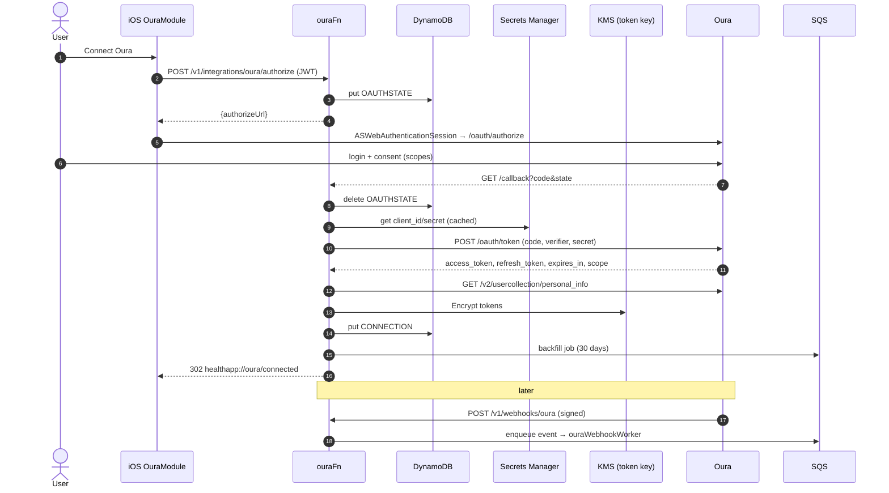

# 5 · Oura Integration Plan

> Server-side integration with the **official Oura API v2** (OAuth 2.0). Implemented by `ouraFn`,
> `ouraWebhookWorker` and `ouraSyncScheduledFn` (backend) and `OuraModule` (iOS: `OuraConnectionService`, `OuraSyncService`).
> Endpoints and storage follow [03 · API](03-api-architecture.md) (§Oura) and [02 · Schema](02-database-schema.md) (`CONNECTION#oura`, GSI2, `OAUTHSTATE#`).
>
> ⚠️ Oura facts in this document (URLs, scopes, rate limits, token lifetimes, webhook headers, membership rules) reflect the Oura developer docs **at time of writing — verify against current docs** (`cloud.ouraring.com/v2/docs`) before implementation and on every Oura API changelog.

## 5.1 Why server-side

| Concern | Decision |
|---|---|
| Client secret | Oura's authorization-code flow requires the `client_secret` at the token endpoint. A secret shipped in an iOS binary is extractable, so the exchange happens in `ouraFn`; the secret lives in **Secrets Manager** (`healthapp/<stage>/oura`). |
| Tokens | Access/refresh tokens are stored only as `tokenCiphertext` (KMS envelope with the dedicated token CMK). The device never sees them. |
| Webhooks | Oura pushes to a public HTTPS endpoint — only a backend can receive them. |
| Background freshness | The hourly scheduled pull works even when the app is never opened. |
| Single source for merge | Oura data lands in DynamoDB next to HealthKit uploads, so `merge.js` precedence is applied once. |

## 5.2 OAuth 2.0 authorization-code flow

| Item | Value (verify) |
|---|---|
| Authorize URL | `https://cloud.ouraring.com/oauth/authorize` |
| Token URL | `https://api.ouraring.com/oauth/token` |
| Revoke URL | `https://api.ouraring.com/oauth/revoke?access_token=…` |
| Redirect URI | `https://api.<domain>/v1/integrations/oura/callback` (registered in the Oura developer app) |
| Scopes (product plan) | `email personal daily heartrate workout tag session spo2` — Oura's docs name the SpO₂ scope `spo2Daily` (verify) |
| Scopes requested today | `backend/src/services/oura.js` `OURA_SCOPES` = `personal daily heartrate workout session spo2Daily`. `email` and `tag` are **deliberately not requested** until a feature needs them (data minimisation); add them in M3 with tags → notes |
| PKCE | We generate `code_verifier`/`code_challenge` (S256) and store the verifier in `OAUTHSTATE#<state>` per API §Oura. If Oura ignores PKCE the `client_secret` still protects the exchange; keep it anyway (defence in depth). Verify Oura PKCE support. |
| State | 32 random bytes, base64url; `OAUTHSTATE#<state>` item `{ sub, codeVerifier, provider:"oura", expiresAt:+10 min }`, deleted on use (single-use) |

Steps:
1. App → `POST /v1/integrations/oura/authorize` → `{ authorizeUrl }`.
2. App opens `ASWebAuthenticationSession(url: authorizeUrl, callbackURLScheme: "healthapp")`.
3. User logs into Oura, grants scopes (users can **untick** scopes — we read the granted `scope` from the token response and store it in `scopes[]`).
4. Oura redirects to our public callback with `code`, `state`.
5. `ouraFn` loads and deletes `OAUTHSTATE#<state>` (conditional delete → replay-safe), exchanges the code (`grant_type=authorization_code`, `client_id`, `client_secret`, `redirect_uri`, `code_verifier`).
6. `GET /v2/usercollection/personal_info` → `id` stored as `ouraUserId` + `GSI2PK = OURAUSER#<id>`.
7. Encrypt `{access_token, refresh_token, expires_at}` → `tokenCiphertext`; write `CONNECTION#oura {status:"connected", scopes, enabledMetrics (defaults), lastSyncAt:null}`.
8. Ensure webhook subscriptions exist (app-level, §5.6) and enqueue an initial **30-day backfill** to SQS.
9. `302 healthapp://oura/connected` (or `healthapp://oura/error?reason=access_denied|state_invalid|exchange_failed`).
10. `ASWebAuthenticationSession` completes; app refreshes `GET /v1/me` and shows "Syncing Oura…".

## 5.3 Sequence



## 5.4 Endpoints used

All under `https://api.ouraring.com`, `Authorization: Bearer <access_token>`. Date-window endpoints take `start_date`/`end_date` (`YYYY-MM-DD`); `heartrate` takes `start_datetime`/`end_datetime` (ISO-8601).

| Endpoint | Scope | Used for | Window |
|---|---|---|---|
| `/v2/usercollection/personal_info` | `personal` (`email` adds email — not requested) | `ouraUserId`, sanity check (we don't store email/age/weight from Oura) | on connect |
| `/v2/usercollection/daily_sleep` | `daily` | `sleepScore` | rolling |
| `/v2/usercollection/daily_readiness` | `daily` | `readinessScore`, `tempDeviationC` | rolling |
| `/v2/usercollection/daily_activity` | `daily` | `activityScore`, `steps`, `activeKcal`, `restingKcal` (derived) | rolling |
| `/v2/usercollection/sleep` | `daily` | `sleepMinutes`, `sleepStages`, `hrvMs`, `restingHr`, `respiratoryRate` | rolling |
| `/v2/usercollection/workout` | `workout` | `WORKOUT#` items | rolling |
| `/v2/usercollection/daily_spo2` | `spo2Daily` | `spo2Pct` | rolling |
| `/v2/usercollection/heartrate` | `heartrate` | workout avg/max HR & TRIMP when Oura workout lacks HR; **not stored raw** | per workout, ≤ 30 days per request (verify) |

`session` is requested but unused in MVP (mindfulness sessions, M3); `tag` (tags → notes) will be requested from M3. `personal_info` is called only for the Oura user id; we do not store Oura's email/age/weight.

**Pagination**: responses are `{ data: [...], next_token: string|null }`. Loop `?next_token=` until null; cap 20 pages per call to bound runaway loops.

## 5.5 Field mapping

| Oura field | Our field | Notes |
|---|---|---|
| `daily_sleep.score` | `metrics.sleepScore` | `day` → `DAY#<day>#oura` |
| `daily_readiness.score` | `metrics.readinessScore` | |
| `daily_readiness.temperature_deviation` | `metrics.tempDeviationC` | °C relative to Oura baseline |
| `daily_activity.score` | `metrics.activityScore` | |
| `daily_activity.steps` | `metrics.steps` | Precedence: HealthKit by default |
| `daily_activity.active_calories` | `metrics.activeKcal` | |
| `daily_activity.total_calories − active_calories` | `metrics.restingKcal` | Derived (schema §2.2.3) |
| `sleep` (document with `type = "long_sleep"`; if none, longest) `.total_sleep_duration / 60` | `metrics.sleepMinutes` | seconds → minutes; `sleep.day` is the wake-up day (verify) — matches our end-date attribution |
| `sleep.deep_sleep_duration / 60` | `sleepStages.deepMin` | |
| `sleep.rem_sleep_duration / 60` | `sleepStages.remMin` | |
| `sleep.light_sleep_duration / 60` | `sleepStages.coreMin` | Oura "light" ≈ Apple "core"; label "Light" in UI when source = Oura |
| `sleep.awake_time / 60` | `sleepStages.awakeMin` | |
| `sleep.average_hrv` | `metrics.hrvMs`, `hrvMethod: "rmssd"` | Never mixed with SDNN in one series |
| `sleep.lowest_heart_rate` | `metrics.restingHr` | Oura's "lowest" ≈ resting; labelled "Lowest sleeping HR" in Recovery detail |
| `sleep.average_breath` | `metrics.respiratoryRate` | |
| `daily_spo2.spo2_percentage.average` | `metrics.spo2Pct` | may be null |
| `workout.id` | `Workout.externalId` | `WORKOUT#<start_datetime>#<uuid>`, `source:"oura"` |
| `workout.activity` | `Workout.type` | mapped via table in `services/oura/activityMap.js`; unknown → `other` |
| `workout.start_datetime / end_datetime` | `start`, `end`, `durationMin` | |
| `workout.calories` | `activeKcal` | |
| `workout.distance` | `distanceM` | |
| `heartrate` samples in window | `avgHr`, `maxHr`, `load` (TRIMP) | computed, samples discarded |

Workouts present in both Oura and HealthKit (overlap > 80 %) — HealthKit wins by default (schema precedence), Oura copy hidden.

## 5.6 Webhooks

**Subscription** (app-level, not per user; managed by a one-off admin script / deploy hook `scripts/oura-webhooks.js`):

```http
POST https://api.ouraring.com/v2/webhook/subscription
x-client-id: <client_id>
x-client-secret: <client_secret>
Content-Type: application/json

{ "callback_url": "https://api.<domain>/v1/webhooks/oura",
  "verification_token": "<random, stored in Secrets Manager>",
  "event_type": "create",            // one subscription per (event_type × data_type)
  "data_type": "daily_sleep" }
```

Subscribed combinations: `event_type ∈ {create, update, delete}` × `data_type ∈ {daily_sleep, daily_readiness, daily_activity, sleep, workout, daily_spo2}` = 18 subscriptions. Subscriptions carry an `expiration_time`; a daily check (in `ouraSyncScheduledFn`'s first run after 00:00 UTC) lists them (`GET /v2/webhook/subscription`) and renews those expiring within 7 days (`PUT /v2/webhook/subscription/renew/{id}`) — verify renewal endpoint.

**Verification challenge**: on create, Oura calls `GET /v1/webhooks/oura?verification_token=…&challenge=…`. `ouraFn` compares the token in constant time and returns `{ "challenge": "<challenge>" }`; otherwise 401.

**Event delivery**: `POST /v1/webhooks/oura` body (verify):
```json
{ "event_type": "update", "data_type": "sleep", "object_id": "…", "event_time": "2026-10-03T06:12:00+00:00", "user_id": "…" }
```
1. Verify `x-oura-signature` = hex(HMAC-SHA256(client_secret, `x-oura-timestamp` + raw body)) in constant time; reject if `|now − timestamp| > 5 min` (API §3.5). Exact signing string — verify.
2. Enqueue the raw event to SQS (`MessageDeduplication` not available on standard queues → worker is idempotent) and return `200` within ~100 ms. Never do Oura calls inline (Oura retries on slow responses).
3. `ouraWebhookWorker`: GSI2 `OURAUSER#<user_id>` → `USER#<sub>`; if no connection or `status != connected` → drop. For create/update: fetch the affected `day` window (`start_date = end_date = day`, ±1 day for sleep) from the matching endpoint and upsert. For delete: tombstone the matching item (`externalId = object_id`) and recompute the day.
4. Failures retry 5× with SQS visibility backoff, then **DLQ** (alarm).

## 5.7 Hourly backfill & reconciliation

`ouraSyncScheduledFn` (EventBridge `rate(1 hour)`):
- Query connections (`CONNECTION#oura`, `status = connected`) — via a Scan of GSI2 (sparse; one item per Oura user). Fan out via SQS in batches of 25 users to keep each invocation < 60 s.
- Per user: fetch `[today − 2, today]` for the six daily endpoints (users' timezone from profile) and upsert. Upserts are idempotent (`DAY#<date>#oura` overwrite with `version + 1` only when content hash changed, to avoid needless sync-feed churn).
- Writes `lastSyncAt`; on error writes `lastError {code, at}`.
- **Manual sync**: `POST /v1/integrations/oura/sync { from?, to? }` (default last 7 days, max 90) runs the same code synchronously for one user.
- **Initial backfill**: 30 days on connect (user can extend to 1 year from Settings → Oura → "Import history"), processed by the worker in 30-day chunks.

## 5.8 Token refresh & revocation

- Before each user's Oura call batch: decrypt; if `expires_at − now < 5 min` → refresh (`grant_type=refresh_token`). Oura refresh tokens are **single-use** (verify) → write the new ciphertext with a conditional update on `version` to avoid two concurrent workers both refreshing; the loser re-reads and uses the winner's token.
- `invalid_grant` on refresh, or 401 after a fresh refresh → `status = "error"`, `lastError = "reauth_required"`, push notification (§5.10).
- **Disconnect** (`DELETE /v1/integrations/oura`): call Oura revoke, delete `tokenCiphertext`, set `status = "revoked"`, remove `GSI2PK`. Existing Oura-sourced data is kept unless the user chooses "Disconnect and delete Oura data" (deletes `DAY#*#oura` and Oura workouts).
- **Account deletion** revokes the token as part of `DELETE /v1/me`.
- User revoking access in the Oura app → next call 401 → same as `invalid_grant`.

## 5.9 Rate limits

Per Oura docs at time of writing: **5,000 requests per 5-minute window** per application (verify whether per app or per user). Controls:
- App-wide fixed-window counter in DynamoDB (atomic `ADD`) checked by all Oura functions; target ≤ 70 % of the limit. Schema §2.2 has no app-level (non-`USER#`) counter item yet — proposed key `PK = SYSTEM#oura`, `SK = RATE#<5-min window>` with TTL; needs a schema update before implementation (per-user `RATE#` items already exist in `lib/keys.js` for the AI limit).
- On `429`: honour `Retry-After` if present, else exponential backoff with jitter (1 s → 32 s); SQS messages are returned with increased visibility timeout.
- Budget: hourly pull ≈ 6 requests/user → 100k connected users = 600k req/h = 50k per 5 min → **exceeds the limit**. Mitigation at scale: rely on webhooks as primary, reduce the hourly pull to users with no webhook in the last 24 h, and stagger across the hour; request a higher limit from Oura before 10k connected users (tracked as risk in doc 10).

## 5.10 Error states surfaced to the user

| Condition | `CONNECTION#oura` | UI | Push |
|---|---|---|---|
| Token refresh failed / access revoked | `status:"error", lastError:"reauth_required"` | Banner on Today & Data Sources: "Reconnect Oura to keep syncing" + button | Yes, once per 72 h |
| No data for ≥ 3 days but token valid | `lastError:"no_recent_data"` | "No new Oura data since Tue. Is your ring synced with the Oura app?" | Yes, once |
| Membership/data unavailable (403/empty with valid token) | `lastError:"membership_required"` | "Oura isn't sharing data. An active Oura Membership may be required." | No |
| Scope missing (e.g. user unticked `workout`) | `scopes[]` lacks it | metric toggle disabled with "Not shared from Oura — reconnect to grant" | No |
| Oura outage / 5xx | `lastError:"provider_unavailable"` | subtle "Oura sync delayed" in Data Sources only | No |
| Rate-limited | — | nothing (internal retry) | No |

Notifications are sent by `notificationsScheduledFn` reading `lastError` changes (APNs via SNS), respecting user notification prefs.

## 5.11 Membership requirement

Oura has stated that users of Gen3 / Oura Ring 4 **need an active Oura Membership for their data to be available through the API** — verify the current policy and its exact effect (403 vs empty data) during M2. Onboarding copy: "Connecting Oura requires an Oura account; some data may require an active Oura Membership."

## 5.12 Test plan

| Level | Cases |
|---|---|
| Unit (Node, `node:test`) | state creation/expiry/replay; token exchange error mapping; HMAC verification (valid, wrong secret, stale timestamp, body tamper); pagination loop with `next_token` and page cap; field mapping per endpoint from **recorded fixtures** (`backend/test/fixtures/oura/*.json`); long_sleep selection; RMSSD tagging; restingKcal derivation; activity type mapping |
| Integration (sandbox / test Oura account) | full connect → callback → backfill; webhook challenge; create/update/delete events end-to-end through SQS; refresh rotation under concurrency (two workers); revoke → reauth state; disconnect & delete data |
| Contract | snapshot of Oura OpenAPI spec checked weekly in CI; diff alerts on field removals |
| Resilience | 429 storm (mock), Oura 5xx, DLQ redrive, duplicate webhook delivery idempotency |
| iOS | `OuraConnectionService` with mocked `ASWebAuthenticationSession`; deep-link handling `healthapp://oura/connected` and `/error?reason=` |
| Manual QA | user unticks scopes; ring not synced for 3 days; timezone travel; membership-lapsed account |
