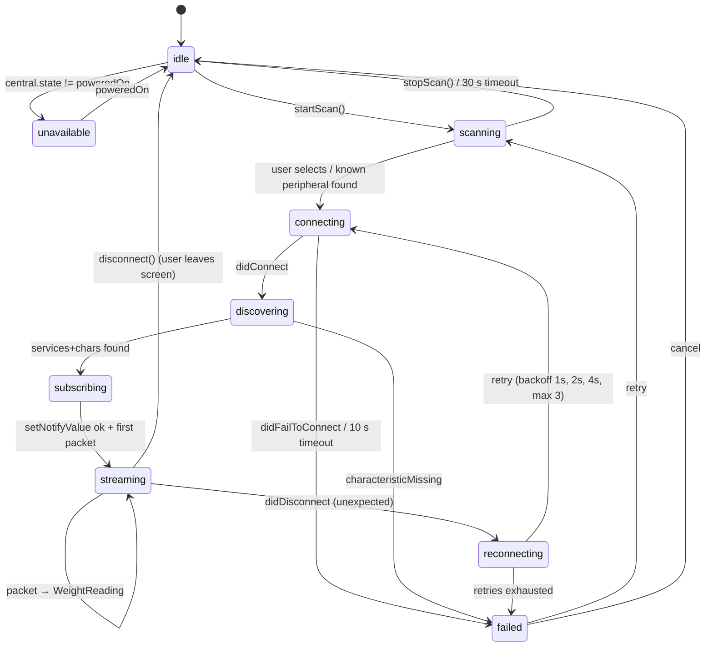
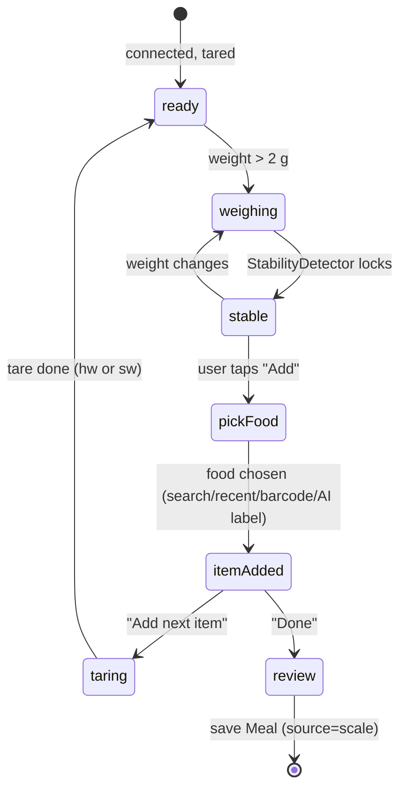

# 6 · Food Scale & Body Scale Architecture (BLE)

> Modules: `FoodScaleKit` (food scales) and `BodyScaleKit` (body scales) in `ios/Packages/HealthAppKit`.
> Food-scale integration ships in **M4** (doc 10); the protocol, mock driver and standard driver exist from M0 so UI can be built against them.
> Bluetooth SIG specs referenced: Weight Scale Service (WSS) 1.0, Body Composition Service (BCS) 1.0 — verify field details against the current GATT Specification Supplement.

## 6.1 Goals

1. **Modular**: adding a scale = adding one driver file + fixtures; no changes to UI or manager.
2. **Honest weights**: only *stable* readings are committed; items weighed on a scale get `weightSource: "scale"` and a collapsed range (`kcalLow = kcalHigh`).
3. **Multi-item meals**: weigh plate components sequentially with tare between items.
4. **Robust**: reconnects, firmware variance and unit switches don't corrupt a session.
5. **Testable without hardware**: `MockFoodScaleDriver` + recorded packet fixtures run in CI.
6. **Battery-friendly**: scan only while a weighing screen is visible; disconnect on exit.

## 6.2 Core types & `FoodScaleDriver` protocol

```swift
import CoreBluetooth

public enum WeightUnit: String, Sendable { case grams, ounces, pounds, milliliters, kilograms }

public struct WeightReading: Sendable, Equatable {
    public var grams: Double          // always normalised to grams
    public var isStable: Bool         // driver-reported OR computed by StabilityDetector
    public var unit: WeightUnit       // unit displayed on the scale itself
    public var isNegative: Bool       // after tare, removing items
    public var timestamp: Date
}

public struct AdvertisementMatch: Sendable {
    public var serviceUUIDs: Set<CBUUID> = []
    public var localNamePrefixes: [String] = []
    public var manufacturerCompanyId: UInt16? = nil      // first 2 bytes (LE) of manufacturer data
    public var manufacturerDataPrefix: Data? = nil       // bytes after the company id
}

public struct ScaleCapabilities: OptionSet, Sendable {
    public let rawValue: Int
    public init(rawValue: Int) { self.rawValue = rawValue }
    public static let hardwareTare    = ScaleCapabilities(rawValue: 1 << 0)
    public static let stableFlag      = ScaleCapabilities(rawValue: 1 << 1)  // packet carries stable bit
    public static let setUnit         = ScaleCapabilities(rawValue: 1 << 2)
    public static let battery         = ScaleCapabilities(rawValue: 1 << 3)
    public static let negativeWeights = ScaleCapabilities(rawValue: 1 << 4)
}

public protocol FoodScaleDriver: AnyObject, Sendable {
    /// Stable identifier, persisted in CONNECTION#foodscale:<driverId>.
    static var driverId: String { get }
    static var displayName: String { get }
    /// Lower = tried first when several drivers match.
    static var matchPriority: Int { get }
    static var advertisementMatch: AdvertisementMatch { get }
    /// Optional deeper check (e.g. manufacturer data version byte) after advertisement match.
    static func matches(advertisement: [String: Any], rssi: Int) -> Bool

    init()
    var capabilities: ScaleCapabilities { get }
    /// Services/characteristics to discover after connect.
    var servicesToDiscover: [CBUUID] { get }
    var characteristicsToNotify: [CBUUID] { get }

    /// Called once characteristics are discovered; driver may write init/handshake commands.
    func didDiscover(characteristics: [CBCharacteristic], on peripheral: CBPeripheral) throws
    /// Parse one notification/indication. Return nil for non-weight packets (battery, ack…).
    func parse(characteristic: CBUUID, value: Data) throws -> WeightReading?
    /// Command bytes for hardware tare, or nil → FoodScaleManager does software tare.
    func tareCommand() -> (characteristic: CBUUID, data: Data, type: CBCharacteristicWriteType)?
    func setUnitCommand(_ unit: WeightUnit) -> (characteristic: CBUUID, data: Data, type: CBCharacteristicWriteType)?
}

public extension FoodScaleDriver {
    static func matches(advertisement: [String: Any], rssi: Int) -> Bool { true }
    func tareCommand() -> (characteristic: CBUUID, data: Data, type: CBCharacteristicWriteType)? { nil }
    func setUnitCommand(_ unit: WeightUnit) -> (characteristic: CBUUID, data: Data, type: CBCharacteristicWriteType)? { nil }
}

public enum FoodScaleError: Error, Sendable {
    case bluetoothUnavailable(CBManagerState), permissionDenied, noMatchingDriver,
         connectionFailed(underlying: String?), characteristicMissing(CBUUID),
         malformedPacket(Data), overload, disconnected, timeout
}
```

## 6.3 `FoodScaleRegistry` & discovery

```swift
public final class FoodScaleRegistry: @unchecked Sendable {
    private var drivers: [any FoodScaleDriver.Type] = []
    public static let `default`: FoodScaleRegistry = {
        let r = FoodScaleRegistry()
        r.register(StandardWeightScaleDriver.self)     // 0x181D / 0x2A9D
        r.register(SampleVendorScaleDriver.self)       // template; excluded from release builds via flag
        return r
    }()
    public func register(_ d: any FoodScaleDriver.Type) { drivers.append(d); drivers.sort { $0.matchPriority < $1.matchPriority } }
    public var scanServiceUUIDs: [CBUUID]? { /* union of serviceUUIDs, nil if any driver needs name-only match */ }
    public func driver(for advertisement: [String: Any], rssi: Int) -> (any FoodScaleDriver.Type)?
}
```

Matching order per advertisement:
1. **Service UUIDs** in `CBAdvertisementDataServiceUUIDsKey` ∩ driver `serviceUUIDs`.
2. **Manufacturer data** (`CBAdvertisementDataManufacturerDataKey`): company id (little-endian UInt16, Bluetooth SIG assigned number) + optional prefix.
3. **Local name** (`CBAdvertisementDataLocalNameKey`) prefix, case-insensitive. Weakest signal; only used with priority ≥ 100.
4. Driver's `matches(advertisement:rssi:)` final check.
First driver (by `matchPriority`) satisfying (1 ∨ 2 ∨ 3) ∧ (4) wins. A matched peripheral's identifier (`CBPeripheral.identifier`) and `driverId` are remembered in `CONNECTION#foodscale:<driverId>` (+ local `UserDefaults` for the peripheral UUID, which is per-device) for auto-reconnect via `retrievePeripherals(withIdentifiers:)`.

Scanning: `scanForPeripherals(withServices: registry.scanServiceUUIDs)` when every driver advertises a service; otherwise `nil` (foreground only — iOS requires service UUIDs for background scanning; we don't scan in background). Results with RSSI < −85 dBm are hidden from the picker.

## 6.4 `FoodScaleManager` state machine



- `FoodScaleManager` is an `actor` owning `CBCentralManager` (delegate callbacks on a dedicated serial queue, bridged into the actor).
- Publishes `AsyncStream<FoodScaleEvent>` (`.state(State)`, `.reading(WeightReading)`, `.battery(Int)`, `.error(FoodScaleError)`); SwiftUI views observe via an `@Observable` view model on the main actor.
- `CBCentralManagerOptionShowPowerAlertKey: true`; no state restoration (foreground only).

## 6.5 Standard Weight Scale Service (0x181D)

| UUID | Name | Properties |
|---|---|---|
| `0x181D` | Weight Scale Service | — |
| `0x2A9E` | Weight Scale Feature | Read — resolution bits (weight resolution 0.5 kg … 0.005 kg), timestamp/multi-user/BMI supported |
| `0x2A9D` | Weight Measurement | **Indicate** |

**0x2A9D layout** (little-endian):

| Offset | Size | Field | Notes |
|---|---|---|---|
| 0 | 1 | Flags | bit0 units: 0 = SI (kg, m), 1 = imperial (lb, in); bit1 timestamp present; bit2 user ID present; bit3 BMI & height present; bits4–7 reserved |
| 1 | 2 | Weight (uint16) | SI: × **0.005 kg**; imperial: × **0.01 lb**. `0xFFFF` = "measurement unsuccessful" |
| 3 | 7 | Time stamp (if bit1) | year uint16, month, day, hours, minutes, seconds (uint8 each) |
| +0 | 1 | User ID (if bit2) | `0xFF` = unknown user |
| +0 | 2 | BMI (if bit3) | × 0.1 |
| +2 | 2 | Height (if bit3) | SI × 0.001 m; imperial × 0.1 in |

```swift
func parseWeightMeasurement(_ d: Data) throws -> WeightReading {
    guard d.count >= 3 else { throw FoodScaleError.malformedPacket(d) }
    let flags = d[d.startIndex]
    let raw = UInt16(d[d.startIndex + 1]) | UInt16(d[d.startIndex + 2]) << 8
    guard raw != 0xFFFF else { throw FoodScaleError.overload }
    let imperial = flags & 0x01 != 0
    let grams = imperial ? Double(raw) * 0.01 * 453.59237 : Double(raw) * 0.005 * 1000
    var expected = 3
    if flags & 0x02 != 0 { expected += 7 }
    if flags & 0x04 != 0 { expected += 1 }
    if flags & 0x08 != 0 { expected += 4 }
    guard d.count >= expected else { throw FoodScaleError.malformedPacket(d) }
    return WeightReading(grams: grams, isStable: true,   // WSS indicates final measurements only
                         unit: imperial ? .pounds : .kilograms, isNegative: false, timestamp: .now)
}
```

> **Limitation**: WSS's best resolution is 5 g (0.005 kg) / ~4.5 g (0.01 lb) and it only indicates *final* measurements — fine for body scales, coarse for kitchen use. Most kitchen scales use **proprietary** services with 0.1–1 g resolution and live streaming, hence the driver system. `StandardWeightScaleDriver` marks items with `grams` rounded to the reported resolution.

## 6.6 Proprietary-protocol drivers

**Preferred order of sourcing a protocol:**
1. Vendor-published SDK/spec or partnership agreement (best: written permission, stable contract).
2. Public documentation by the vendor (developer pages, open firmware).
3. **Interoperability analysis of a device we own**: capture our own BLE traffic (Apple's *PacketLogger* with the Bluetooth logging profile, or nRF Sniffer / nRF Connect) between the vendor app and the scale; document characteristic UUIDs and packet formats.
   - Legal guardrails (get legal sign-off per vendor; jurisdiction-dependent — e.g. EU Software Directive Art. 6 and US DMCA §1201(f) interoperability exceptions): only observe traffic of hardware we bought; do **not** decompile or redistribute vendor app code, bypass encryption/authentication, or use vendor trademarks beyond nominative "works with X"; check the vendor's ToS; stop if the vendor objects.
   - Write the result up as `FoodScaleKit/Drivers/<Vendor>/PROTOCOL.md` (our own words, packet tables, captured fixtures).
4. Never ship a driver that requires pairing keys extracted from vendor apps.

**Firmware variance**: drivers must tolerate (a) extra trailing bytes, (b) different packet lengths per firmware, (c) missing stable flag (fallback to `StabilityDetector`), (d) unit byte variations. Read Device Information Service (`0x180A`: firmware `0x2A26`, model `0x2A24`) when present and log (anonymised) on parse failure; fixtures are organised per firmware version.

`SampleVendorScaleDriver` is the template: custom 128-bit service, one notify characteristic, packet `[0xAC, flags, weight_lo, weight_hi, unit, checksum]` with `weight × 0.1 g`, `flags bit0 = stable, bit1 = negative`, XOR checksum — purely illustrative.

## 6.7 Stable-weight detection

Used when the driver can't report stability (or to double-check it):

```
window W = last 1.0 s of readings (≥ 4 samples)
stable  ⇔  max(W) − min(W) ≤ max(1 g, 0.5 % × median(W))
        ∧  |median(W)| ≥ 2 g   (ignore near-zero noise)
        ∧  held for ≥ 0.6 s
unstable as soon as a reading deviates > 2× tolerance from the locked value
```

- UI shows a "Stable" indicator (icon + text + haptic `.success`), the commit button is enabled only when stable; users can override ("Use this weight anyway") which records `weightSource: "user"` instead of `"scale"`.
- Constants live in `StabilityDetector.Configuration` and are tuned per driver (e.g. 0.1 g scales use tighter tolerance).

## 6.8 Tare & units

- **Hardware tare** when `capabilities.contains(.hardwareTare)` → write `tareCommand()`; wait for a ~0 g stable reading (timeout 3 s → fall back to software tare).
- **Software tare**: `offset = current stable grams`; displayed = raw − offset. Software offset resets when the scale reports a new zero (raw ≈ 0) or on reconnect.
- **Units**: everything internal is grams. If the scale shows oz/lb/ml, we convert (`1 oz = 28.349523125 g`, `1 lb = 453.59237 g`); **ml on kitchen scales is water-equivalent (1 ml = 1 g)** — we keep grams and warn when logging non-water liquids. Display unit follows `profile.units`, not the scale.

## 6.9 Multi-item weighing session



- Each committed item: `{ grams, weightSource: "scale", range: kcalLow = kcalHigh }`.
- **Subtractive weighing** ("weigh the bowl before and after eating"): negative deltas after tare are allowed when `.negativeWeights` or software tare; item grams = |delta|.
- A session combined with a **photo** sends `scaleReadings: [{grams, label?}]` to `/v1/ai/meal-analysis` for fusion (doc 07 §7.6).
- Session state is kept in memory + `UserDefaults` draft so an accidental app switch doesn't lose weighed items.

## 6.10 Error handling

| Error | User-facing | Recovery |
|---|---|---|
| Bluetooth off | "Turn on Bluetooth to use your scale" | observe state → resume |
| Permission denied (`CBManagerAuthorization.denied`) | explain + Settings deep link | — |
| No matching driver | "This scale isn't supported yet" + "Request support" | log anonymised advertisement (name, service UUIDs, company id) with consent |
| Disconnect mid-session | "Scale disconnected — reconnecting…" | auto-reconnect 3×; weighed items preserved |
| Overload / `0xFFFF` | "Over the scale's limit" | — |
| Malformed packets (> 5 in 10 s) | "Readings look unreliable" | suggest re-pair; capture fixture in debug builds |
| Never stable (> 20 s) | "Hold still…" then manual override | — |

## 6.11 Testing

- **`MockFoodScaleDriver`**: scripted `[(delay, grams, stable?)]` timelines (e.g. "plate → rice → stable 182 g → tare → chicken"); used by SwiftUI previews, demo environment and UI tests.
- **Packet fixtures**: `Tests/FoodScaleKitTests/Fixtures/<driverId>/<firmware>/*.hex` — one captured packet per line with expected JSON output. `DriverFixtureTests` iterates all fixtures for all registered drivers.
- **Unit tests**: WSS flag combinations (all 16), imperial conversion, `0xFFFF`, short packets, timestamp/user/BMI offsets; `StabilityDetector` with noisy synthetic series; software tare math; registry matching precedence.
- **Hardware-in-the-loop** (manual, pre-release): matrix of supported scales × iPhone models × iOS versions; reference weights (100 g / 500 g calibration masses) to verify ±1 g.

## 6.12 Adding a new food scale — step by step

1. **Get the device and the right to integrate** (§6.6). Record vendor, model, firmware.
2. **Capture**: nRF Connect → note advertised services, local name, manufacturer data; PacketLogger capture while weighing 0 g → 100 g → tare → unit change.
3. **Document** in `Drivers/<Vendor>/PROTOCOL.md`: characteristics, packet layout, flags, checksum, commands.
4. **Create fixtures** from captures (`.hex` + expected readings).
5. **Implement** `<Vendor>ScaleDriver: FoodScaleDriver` in `FoodScaleKit/Drivers/<Vendor>/` — copy `SampleVendorScaleDriver`; fill `advertisementMatch`, `parse`, `tareCommand`, capabilities.
6. **Register** in `FoodScaleRegistry.default` with a `matchPriority` (10 = service UUID match, 50 = manufacturer data, 100 = name only).
7. **Tests**: fixture tests green; add a mock timeline replicating the scale's cadence.
8. **HIL test** with calibration weights; tune `StabilityDetector.Configuration`.
9. **Docs/UI**: add model to the supported-devices list (Settings → Devices) with nominative naming only.
10. **Release** behind a remote flag for one version; monitor parse-failure metrics.

---

## 6.13 Body scales

### Strategy

| Phase | Provider | How |
|---|---|---|
| MVP | `HealthKitBodyScaleProvider` | Any scale whose app writes to Apple Health (Withings, Eufy, Renpho, Garmin, etc. — verify each app's HK support) — read `bodyMass`, `bodyFatPercentage`, `leanBodyMass`, `bodyMassIndex` (doc 04) |
| M4 | `BLEBodyCompositionProvider` | Direct GATT: WSS `0x181D`/`0x2A9D` + BCS `0x181B`/`0x2A9C`; then write results to HealthKit (opt-in) |
| Future | `<Vendor>CloudBodyScaleProvider` (e.g. Withings Public API OAuth 2.0) | Server-side, same pattern as Oura (token in KMS ciphertext); only if user lacks HK sync |

```swift
public protocol BodyScaleProvider: Sendable {
    var id: String { get }                         // "healthkit", "ble:<driverId>", "withings"
    var supportedMetrics: Set<BodyMetric> { get }   // weight, bodyFatPct, muscleMassKg, bmi, visceralFat, waterPct, boneMassKg, bmrKcal
    func measurements(since: Date) async throws -> [BodyMeasurement]
    func observe() -> AsyncStream<BodyMeasurement>  // live (BLE) or HK observer
}
```

Connections are stored as `CONNECTION#bodyscale:<id>` with `enabledMetrics[]`.

### Body Composition Measurement `0x2A9C` (Indicate)

| Field | Size | Present when (flags uint16) | Resolution |
|---|---|---|---|
| Flags | 2 | always | bit0 units, bit1 timestamp, bit2 user ID, bit3 basal metabolism, bit4 muscle %, bit5 muscle mass, bit6 fat-free mass, bit7 soft lean mass, bit8 body water mass, bit9 impedance, bit10 weight, bit11 height, bit12 multiple packets |
| Body fat % | 2 | always | 0.1 % |
| Time stamp | 7 | bit1 | — |
| User ID | 1 | bit2 | — |
| Basal metabolism | 2 | bit3 | 1 **kJ** (→ kcal ÷ 4.184) |
| Muscle percentage | 2 | bit4 | 0.1 % |
| Muscle mass | 2 | bit5 | 0.005 kg / 0.01 lb |
| Fat-free mass | 2 | bit6 | 0.005 kg / 0.01 lb |
| Soft lean mass | 2 | bit7 | 0.005 kg / 0.01 lb |
| Body water mass | 2 | bit8 | 0.005 kg / 0.01 lb |
| Impedance | 2 | bit9 | 0.1 Ω (not stored) |
| Weight | 2 | bit10 | 0.005 kg / 0.01 lb |
| Height | 2 | bit11 | 0.001 m / 0.1 in |

Multi-packet measurements (bit12) are reassembled before mapping. Measurements require a **user index** on multi-user scales (User Data Service `0x181C` consent code) — implement UDS registration in M4.

### Metric mapping

| Our field (`BODY#`) | HealthKit | BLE (WSS/BCS) | Notes |
|---|---|---|---|
| `weightKg` | `bodyMass` | `0x2A9D` weight / `0x2A9C` weight | |
| `bodyFatPct` | `bodyFatPercentage` (×100) | `0x2A9C` body fat % | |
| `muscleMassKg` | `leanBodyMass` (labelled "Lean mass") | `0x2A9C` muscle mass | different quantities — label by source |
| `bmi` | `bodyMassIndex` | `0x2A9D` BMI | we can also compute from `heightCm` |
| `visceralFat` | — | vendor-specific (not in BCS) | proprietary drivers / vendor cloud only |
| `waterPct` | — | body water mass ÷ weight × 100 | |
| `boneMassKg` | — | vendor-specific | |
| `bmrKcal` | — (`basalEnergyBurned` is daily energy, not BMR) | basal metabolism kJ ÷ 4.184 | |

Bioimpedance values are **estimates** with large individual error; Body tab labels them "Estimated by your scale" and trends them on 7-day averages, never daily deltas.
