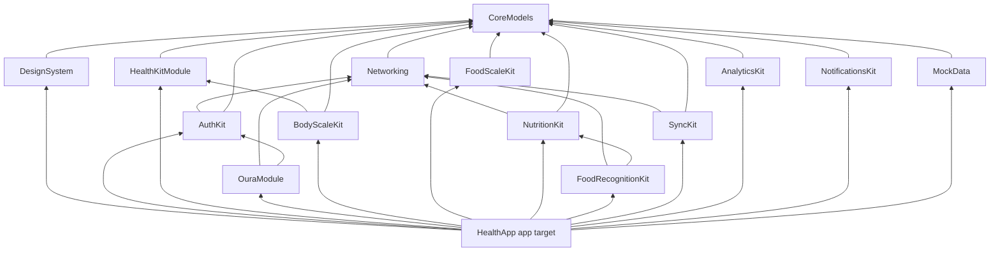

# 9 · SwiftUI Project Structure

> The iOS app lives in `healthapp/ios/`. It is a thin **app target** (composition root + feature UI) on top of a
> local Swift package **`HealthAppKit`** that exposes one library product per module. iOS 17+, Swift 5.10+/Swift 6 toolchain in Swift 5 language mode, SwiftUI + Swift Charts + SwiftData.

## 9.1 Tree

```
healthapp/ios/
├── project.yml                         # XcodeGen spec → HealthApp.xcodeproj (iOS 17+, Swift 5.10+/6 toolchain, language mode 5)
├── README.md                           # build/run instructions, demo vs live
├── HealthApp/                          # App target (thin): composition root + feature UI
│   ├── App/
│   │   ├── HealthAppApp.swift          # @main; builds AppEnvironment, registers BG tasks & HK observers
│   │   ├── AppEnvironment.swift        # DI container; .demo vs .live wiring
│   │   └── RootTabView.swift           # tab bar + navigation stacks
│   ├── Features/
│   │   ├── Today/                      # TodayView: "Fuel · Train · Recover" card, Daily Energy, macro rings, metric cards, today's workouts, hydration
│   │   ├── Food/                       # FoodLogView, AddFoodSheet, PhotoLogFlow (capture → analyzing → ConfirmItemsView → save), ScaleLogFlow, BarcodeScannerView (VisionKit DataScannerViewController), FoodSearchView, VoiceLogView (Speech), MealEditorView, RecipesView, CustomFoodView, FoodHistoryView
│   │   ├── Activity/                   # steps, active energy, workouts list, training load
│   │   ├── Recovery/                   # sleep score, readiness, HRV, resting HR, sleep stages, temperature
│   │   ├── Body/                       # weight, 7-day-avg trend line, body composition, add measurement
│   │   ├── Trends/                     # TrendsHomeView, TrendDetailView, CompareView (scatter + Pearson r + caveat)
│   │   ├── Coach/                      # CoachView chat, suggested questions, disclaimer
│   │   ├── Calendar/                   # CalendarView month grid → DayDetailView
│   │   ├── Settings/                   # SettingsView, DataSourcesView, DevicesView, NotificationsSettingsView, GoalsView, AccountView (delete & export)
│   │   └── Onboarding/                 # welcome, Sign in with Apple, connect sources step-by-step
│   └── Resources/                      # Assets.xcassets, Info.plist keys, HealthApp.entitlements (HealthKit + background delivery, Sign in with Apple, push), PrivacyInfo.xcprivacy
├── HealthAppTests/                     # app-level tests (AppEnvironment wiring, view-model tests)
└── Packages/HealthAppKit/              # local Swift package, one library product per module
    ├── Package.swift
    ├── Sources/
    │   ├── CoreModels/                 # pure value types: Meal, FoodItem, Nutrients, NutrientRange, MealCategory, DailyMetrics, MetricSource, BodyMeasurement, Workout, Goals, Profile, Connection, DaySummary, TrendPoint, unit helpers
    │   ├── DesignSystem/               # colors, typography, Card, MetricTile, RingView, Sparkline, ConfidenceBadge, EmptyState
    │   ├── Networking/                 # APIClient (async/await URLSession), Endpoint definitions mirroring docs/03, token injection, retry/backoff
    │   ├── AuthKit/                    # CognitoAuthService (Hosted UI + PKCE, identity_provider=SignInWithApple), KeychainStore, token refresh
    │   ├── HealthKitModule/            # HealthKitService protocol + HKHealthStore impl (auth per type, statistics collections, sleep, workouts, body read/write, nutrition write, observers, anchored queries)
    │   ├── OuraModule/                 # OuraConnectionService (backend authorize → ASWebAuthenticationSession → healthapp://oura/connected), OuraSyncService
    │   ├── BodyScaleKit/               # BodyScaleProvider; HealthKitBodyScaleProvider; BLEBodyCompositionProvider (0x181D + 0x181B, later)
    │   ├── FoodScaleKit/               # FoodScaleDriver, FoodScaleRegistry, FoodScaleManager, StandardWeightScaleDriver, sample vendor driver template, MockFoodScaleDriver, WeightReading
    │   ├── NutritionKit/               # NutritionCalculator, NutritionDatabase protocol, RemoteNutritionDatabase (/foods), LocalFoodCache, household units
    │   ├── FoodRecognitionKit/         # MealPhotoPipeline client: downscale/JPEG/strip EXIF, presigned upload, analysis request with scale readings, map to editable draft
    │   ├── SyncKit/                    # SwiftData models + LocalStore (NSFileProtectionComplete), Outbox (PendingChange), SyncEngine, BGTaskScheduler registration, NWPathMonitor
    │   ├── AnalyticsKit/               # EnergyBalance + neutral FuelingInsight, TrendStats, Pearson + caveat, training load, rolling averages, DailyBalance composer (powers the Fuel · Train · Recover card)
    │   ├── NotificationsKit/           # local notifications (meal, hydration, sleep consistency, protein progress), push registration, categories
    │   └── MockData/                   # DemoDataProvider: 90 days of realistic data for Simulator without backend/HealthKit/Oura
    └── Tests/
        ├── AnalyticsKitTests/
        ├── NutritionKitTests/
        ├── FoodScaleKitTests/          # byte parsing + packet fixtures
        ├── CoreModelsTests/
        └── SyncKitTests/               # conflict merge
```

## 9.2 Module dependency graph

Rules: `CoreModels` depends on nothing; feature UI only in the app target; no package module imports `SwiftUI` except `DesignSystem` (and `MockData` previews helpers if needed); no cycles (enforced by SwiftPM).



## 9.3 Composition root & DI

- **`AppEnvironment`** (app target) is the only place concrete types are chosen. It is an `@Observable`, `@MainActor` final class holding protocol-typed services:

```swift
@MainActor @Observable
final class AppEnvironment {
    let auth: any AuthService
    let api: any APIClientProtocol
    let health: any HealthKitService
    let oura: any OuraConnectionServicing
    let foodScales: FoodScaleManager
    let bodyScales: [any BodyScaleProvider]
    let nutrition: any NutritionDatabase
    let recognition: any MealPhotoPipelineProtocol
    let store: LocalStore
    let sync: SyncEngine
    let notifications: any NotificationScheduling
    let mode: Mode
    enum Mode { case demo, live }

    static func live(config: AppConfig) -> AppEnvironment { … }   // real Cognito, URLSession, HKHealthStore, CoreBluetooth
    static func demo() -> AppEnvironment { … }                    // MockData-backed fakes
}
```

- Injected once at the root with `.environment(appEnvironment)`; features read it via `@Environment(AppEnvironment.self)` and build their own `@Observable` view models with the services they need (constructor injection → easy unit tests).
- Package modules never reach for globals; each exposes protocols + a live implementation, and `MockData` provides demo implementations.

## 9.4 Demo vs live environments

| | Demo | Live |
|---|---|---|
| Selection | Scheme `HealthApp-Demo` / launch arg `-demo`, or "Try the demo" in onboarding | Default scheme |
| Auth | Fake signed-in user | Cognito Hosted UI + Sign in with Apple |
| Data | `DemoDataProvider`: 90 days of deterministic, seeded meals, metrics, workouts, body, sleep | Backend + HealthKit + Oura |
| HealthKit / BLE | `DemoHealthKitService`, `MockFoodScaleDriver` timelines | `HKHealthStore`, CoreBluetooth |
| AI | Canned `MealAnalysis` fixtures with ranges | `/v1/ai/*` |
| Persistence | In-memory SwiftData container | On-disk encrypted store |
| Use | Simulator, SwiftUI previews, UI tests, App Review demo | Production, TestFlight |

`AppConfig` (API base URL, Cognito domain/client id, stage) comes from an `.xcconfig` per configuration (`Dev`, `Prod`); no secrets in the app.

## 9.5 Concurrency model

- Swift structured concurrency throughout; **UI and view models are `@MainActor`**.
- Services are `Sendable` protocols; stateful services are **actors**: `SyncEngine`, `FoodScaleManager`, `LocalStore` writer (`@ModelActor`), token refresher in `AuthKit` (single-flight refresh), HealthKit anchor store.
- Delegate-based Apple APIs (CoreBluetooth, HKObserverQuery, ASWebAuthenticationSession) are bridged with `AsyncStream` / `withCheckedThrowingContinuation` at module boundaries.
- Long work (initial HealthKit backfill, export) runs in detached tasks with cancellation checks; UI observes progress via `AsyncStream`.
- Strict concurrency checking `complete` in package targets (warnings as errors in CI) to ease Swift 6 language-mode migration.

## 9.6 Persistence & encryption

- **SwiftData** models in `SyncKit`: `MealEntity`, `FoodItemEntity`, `DailyMetricsEntity`, `BodyMeasurementEntity`, `WorkoutEntity`, `NoteEntity`, `PendingChange` (schema §2.5), plus `SyncCursor` and HealthKit anchors.
- Store file in Application Support with **`NSFileProtectionComplete`**, excluded from iCloud backup (HealthKit-derived data rule, doc 01 §1.9). Consequence: the app's data cannot be read while the device is locked → background tasks that need the store run only after first unlock while unlocked; HealthKit background deliveries while locked are deferred (observer completes immediately, work resumes on unlock).
- Tokens (Cognito) in **Keychain**, `kSecAttrAccessibleAfterFirstUnlockThisDeviceOnly`, no iCloud Keychain sync.
- Image cache (meal thumbnails) in Caches with `completeUntilFirstUserAuthentication`; purged after 30 days to mirror server retention.
- Sign-out / account deletion wipes the store, caches, Keychain items and HealthKit anchors.

## 9.7 Background tasks

| Task | Mechanism | Work |
|---|---|---|
| HealthKit changes | `HKObserverQuery` + background delivery | anchored queries → `/metrics/daily`, `/body`, `/workouts` |
| Outbox drain + pull | `BGAppRefreshTask` `com.healthapp.sync` (earliest 30 min) | `SyncEngine.push()` then `pull()` |
| Heavier maintenance | `BGProcessingTask` `com.healthapp.maintenance` (requires power) | backfill catch-up, cache cleanup, photo upload retries |
| Connectivity | `NWPathMonitor` | trigger drain when online |
| Local notifications | `UNUserNotificationCenter` schedules (NotificationsKit) | meal/hydration/protein reminders computed locally |
| Remote push | APNs via SNS | sync problems, Oura reauth |

Identifiers listed in `BGTaskSchedulerPermittedIdentifiers`; tasks registered in `HealthAppApp.init` before launch completes.

## 9.8 Testing strategy

| Layer | Tooling | Focus |
|---|---|---|
| Pure logic (`AnalyticsKit`, `NutritionKit`, `CoreModels`) | Swift Testing (`@Test`) / XCTest | energy balance, fueling message rules (good/bad copy table from doc 01 is a test fixture), Pearson & caveat thresholds, rolling averages, unit conversions, range math |
| `FoodScaleKit` | fixtures + `MockFoodScaleDriver` | WSS flag matrix, vendor packets, stability detector, tare |
| `SyncKit` | in-memory SwiftData + stub API | outbox ordering, conflict merge (meal field-level LWW, server-wins otherwise), cursor paging |
| `Networking` | `URLProtocol` stubs with JSON fixtures shared with backend contract tests | encoding/decoding of every docs/03 shape, error envelope, retry/backoff, 401 refresh |
| `HealthKitModule` | protocol fakes; device-only integration suite (manual) | mapping, sleep session grouping, dedupe |
| App | `HealthAppTests` + XCUITest on demo environment | onboarding, log photo meal (fixtures), weigh with mock scale, delete account flow |
| Snapshots | SwiftUI previews rendered in tests | light/dark, Dynamic Type XL/AX3, contrast tokens |
| Accessibility | `performAccessibilityAudit()` (Xcode 15+) in UI tests | labels, contrast, hit areas |

CI: `xcodegen generate` → `xcodebuild test` on iOS Simulator for package + app; failing snapshot or audit blocks merge.

## 9.9 Adding a new integration (generic recipe)

1. **Decide where it runs**: device-only (HealthKit-like, BLE) → new package module or driver; needs secrets/OAuth/webhooks → backend provider (Oura pattern, doc 05) + thin client module.
2. **Model the data** in `CoreModels` only if new fields are needed; prefer mapping onto existing `DailyMetrics` keys / `BodyMeasurement` / `Workout`. New metric keys require updating docs/02 §2.2.3 first (contract), then backend `merge.js` precedence.
3. **Define a protocol** in the module (e.g. `FooProvider: Sendable`) with live + demo implementations; demo data added to `MockData`.
4. **Connection & consent**: provider id `foo` → `CONNECTION#foo` with `enabledMetrics[]`; add a card to `DataSourcesView` and onboarding source list.
5. **Wire** in `AppEnvironment.live/demo` only.
6. **Sync path**: re-derivable device data → idempotent upload endpoints; user-authored data → Outbox.
7. **Precedence**: add default precedence entry and a Settings picker row.
8. **Privacy**: purpose strings / `PrivacyInfo.xcprivacy`, data-minimisation review, deletion path (`DELETE /v1/me` must cover it), export inclusion.
9. **Tests**: mapping fixtures, demo environment UI test, error-state UI.
10. **Docs**: add a section to the relevant doc (04/05/06) and a roadmap entry in doc 10.
