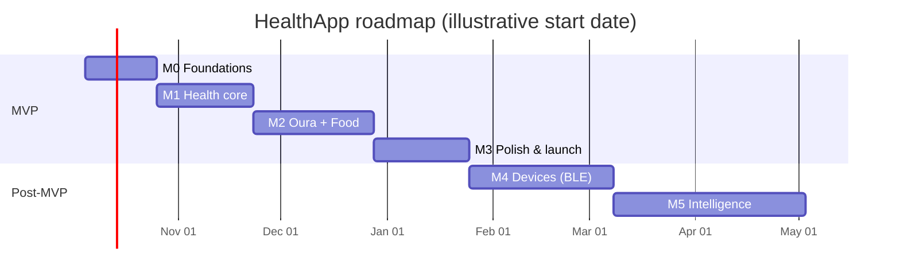

# 10 · MVP Plan & Roadmap

## 10.1 MVP scope

The MVP proves the core loop: **connect sources → see an honest daily picture → log food quickly → see trends**.

| # | Feature | In MVP | Notes |
|---|---|---|---|
| 1 | Apple Health connection | ✅ | read metrics/sleep/workouts/body; optional nutrition write-back |
| 2 | Oura connection | ✅ | server-side OAuth, webhooks + hourly pull |
| 3 | Daily dashboard (Today) | ✅ | Fuel·Train·Recover card, Daily Energy, metric tiles |
| 4 | Weight tracking | ✅ | via Apple Health (any scale app) + manual |
| 5 | AI meal-photo logging | ✅ | Claude on Bedrock, ranges, confirm UI |
| 6 | Calories & macros | ✅ | USDA-based, server-computed |
| 7 | Manual food editing | ✅ | meal editor, search, custom foods |
| 8 | Food history | ✅ | by day, recents, saved meals |
| 9 | Trends | ✅ | per-metric detail + compare with caveat |
| — | Barcode, voice, recipes, calendar, coach | Beta flag in MVP (barcode, calendar) / M3 (voice, coach, recipes) | |
| — | Direct BLE body scale & food scale | ❌ → M4 | protocol + mock exist from M0 |

## 10.2 Acceptance criteria

| Feature | Acceptance criteria |
|---|---|
| **Apple Health** | Per-metric toggles request only selected types. 90-day backfill completes < 60 s on iPhone 13 with typical data. Daily `steps`/`activeKcal` equal Health app's daily totals (same day, ±1 %). New weight sample from a scale app appears in Body within 5 min with app open, and after next background delivery otherwise. Sleep attributed to wake date; stages shown when available. No HealthKit data in iCloud. Revoking in Settings → Health results in "No data" state, never a crash. |
| **Oura** | Connect flow completes with tokens stored only server-side (verified: no token in device storage or logs). Data for last 30 days visible within 2 min of connecting. Webhook update appears ≤ 15 min p90; missed webhook recovered by hourly pull. Token refresh rotation safe under concurrent workers (test). Revoked access → "Reconnect Oura" banner + one push. Disconnect revokes token and stops sync. |
| **Daily dashboard** | Loads from cache < 1.5 s p90; shows Fuel·Train·Recover card with neutral message from rule table (doc 01 §1.10) — all good/bad copy examples covered by unit tests. Estimates labelled; ranges shown. Empty/loading/error/offline states implemented per doc 08. VoiceOver reads every tile. |
| **Weight tracking** | Shows daily points + 7-day average; manual entry writes to backend and (opt-in) HealthKit; duplicates from two apps within 2 min/0.1 kg collapse to one. Units follow profile. No messages about daily gain/loss. |
| **AI photo logging** | Photo → editable analysis ≤ 12 s p90. EXIF/GPS stripped (unit test). Model output never contains calories; nutrients come from USDA × grams. Every item has confidence + gram range; meal flagged Estimate. Eval set: identification F1 ≥ 0.80, kcal MAPE ≤ 25 %, **range coverage ≥ 80 %**. Rate limit 30/h enforced (429 handled in UI). Photos deleted after 30 days unless pinned (lifecycle verified in dev). |
| **Calories & macros** | Server recomputes `totals` on every `PUT /v1/meals/{id}`; client and server totals agree to 0.1 g / 1 kcal (shared fixtures). Day totals show range if any estimate. Goals optional; no target below safety floor. |
| **Manual editing** | Edit grams/food/category/time of any item; changes sync; offline edits survive app kill and sync later; conflicting edits on two devices merge per item (field-level LWW). |
| **Food history** | Browse any past day; search past meals; "log again" on any meal/item; recents list accurate. |
| **Trends** | All trend metric ids from API §3.3 render for 7d/30d/90d/1y with day/week aggregation; Compare shows r, n, caveat; hides r when n < 14. Charts have accessibility descriptors. |
| **Cross-cutting** | Sign in with Apple via Cognito; account deletion removes all server data, S3 objects and Cognito user within minutes (integration test); export ZIP contains every entity type. Crash-free sessions ≥ 99.5 % in TestFlight. |

## 10.3 What's in the repo now (at time of writing — work in progress in parallel)

| Path | Status |
|---|---|
| `README.md` | Overview, doc index, architecture diagram |
| `docs/02-database-schema.md`, `docs/03-api-architecture.md` | **Binding contracts** |
| `docs/01, 04–11` | This documentation set |
| `backend/package.json` | Node.js 22 ESM, AWS SDK v3 clients, `@anthropic-ai/bedrock-sdk` |
| `backend/src/lib/*` | Key builders (`keys.js`, incl. `RATE#`, `NOTIFLOG#`), DynamoDB repository, HTTP/error helpers, KMS envelope, Secrets, S3 presign, validation & schemas, logger, rate limit, dates, zip |
| `backend/src/services/*` | `merge.js` (precedence), `energy.js`, `daySummary.js`, `trends.js`, `stats.js`, `nutrition.js`, `usda.js`, `openfoodfacts.js`, `oura.js` (OAuth, pagination, mapping, webhook HMAC), `ouraSync.js`, `userData.js` (export/delete), `ai/claude.js` (Bedrock Mantle client, adaptive thinking, explicit effort, structured output, stop-reason handling) |
| `backend/src/handlers/*`, `backend/template.yaml`, `backend/test/*` | In progress (SAM template per doc 11) |
| `ios/Packages/HealthAppKit/Sources/CoreModels`, `AnalyticsKit`, `Networking`, `NutritionKit` | First modules landed (models, DailyBalance, EnergyBalance, MetricMerger, Correlation, TrainingLoad, APIClient, NutritionCalculator) |
| Remaining iOS modules & app target | In progress per doc 09 tree |

## 10.4 Milestones

| Milestone | Duration (est.) | Scope | Exit criteria |
|---|---|---|---|
| **M0 — Foundations** | 3 wks | Repo, XcodeGen, HealthAppKit skeleton, DesignSystem tokens, MockData demo env, SAM template (Cognito+Apple, HTTP API, DynamoDB, S3, KMS), CI (lint/test/sam build), dev stage deployed | App runs in Simulator on demo data; `/v1/me` works with Apple sign-in in dev |
| **M1 — Health core** | 4 wks | HealthKitModule (read, observers, anchored, backfill), `/metrics/daily`, `/body`, `/workouts`, merge precedence, Today, Activity, Recovery, Body, Trends v1, offline SyncKit | Acceptance criteria 1, 3, 4, 9 met on device |
| **M2 — Oura + Food** | 5 wks | Oura OAuth/webhooks/hourly; nutrition DB (USDA), search, custom foods, meal editor, food log/history; AI photo pipeline + eval harness; barcode (beta) | Criteria 2, 5, 6, 7, 8 met; eval targets met on held-out set |
| **M3 — MVP polish & launch** | 4 wks | Accessibility audit, privacy review, App Store review prep (HealthKit justification, demo account, 5.1.3/5.1.1(v)), Calendar, notifications, export/delete hardening, prod stage, WAF, alarms; then Voice, Recipes, Coach (beta) | App Store approval; TestFlight crash-free ≥ 99.5 %; on-call runbook |
| **M4 — Devices** | 6 wks | FoodScaleKit live (StandardWeightScaleDriver + first 2 vendor drivers), multi-item weighing, scale-photo fusion; BLEBodyCompositionProvider (WSS + BCS + UDS); HK write-back of body readings | Weighed meals ±1 g vs calibration masses; 2 vendor scales certified in HIL matrix |
| **M5 — Intelligence & scale** | ongoing | Coach GA with citations, weekly insights, cycle-aware context (opt-in), vendor cloud body-scale providers (e.g. Withings), restaurant DB if licensed, Apple Watch companion, localisation | Retention & accuracy targets (§10.6) |

## 10.5 Risks & mitigations

| Risk | Likelihood / impact | Mitigation |
|---|---|---|
| **HealthKit App Review rejection** (unclear purpose strings, iCloud storage, missing deletion, HealthKit data used beyond health purposes) | M / H | Follow doc 01 §1.9 checklist; precise purpose strings; demo account + review notes; in-app deletion; no analytics SDK touching health data; pre-submission internal review against guidelines 5.1.1, 5.1.3, 27.x (HealthKit) — verify current numbering |
| **Oura API change / membership requirement / rate limits** | M / M | Contract snapshot test of OpenAPI weekly; isolated mapping module; membership messaging; webhooks-first + staggered pulls; request limit increase before 10k Oura users |
| **AI estimate accuracy** (portion size, hidden oil, mixed dishes) | H / M | Ranges + Estimate labelling; clarifying questions; scale fusion; eval gates (coverage ≥ 80 %); one-tap corrections; collect opt-in corrections for eval growth |
| **AI over-trust / harmful framing** | M / H | Model never outputs kcal; neutral copy rules tested; ED-sensitive mode; safety eval set; coach disclaimers |
| **BLE vendor variance** (proprietary protocols, firmware changes) | H / M | Driver system, fixtures per firmware, remote kill-switch per driver, HealthKit path as default for body scales |
| **Legal risk of reverse-documenting protocols** | L / M | Legal sign-off per vendor, interoperability-only analysis, prefer partnerships |
| **Cost overrun (Bedrock)** | M / M | Rate limits 30/h, image ≤ 1568 px, effort tuning, prompt caching, budget alarms, per-user soft caps, cost per MAU tracked (doc 11) |
| **Nutrition data licensing** (OFF ODbL share-alike, commercial DB terms) | M / M | USDA first; OFF partition + attribution; legal review before enabling OFF/commercial in prod |
| **Data breach** | L / H | KMS CMKs, least privilege, no bodies in logs, WAF, threat model (doc 11), pen test before launch |
| **Two-source double counting** (Oura + Watch) | M / M | Precedence (never sum), visible source badges, user override |

## 10.6 Success metrics

| Area | Metric | Target (6 months post-launch) |
|---|---|---|
| Activation | % new users connecting ≥ 1 source in first session | ≥ 70 % |
| Engagement | D30 retention | ≥ 35 % |
| Logging | Median meals logged/active day | ≥ 2.5 |
| AI | % photo meals saved without deleting all items | ≥ 85 %; median edits per photo meal ≤ 1.5 |
| AI accuracy | Eval range coverage / kcal MAPE (quarterly) | ≥ 80 % / ≤ 25 % |
| Speed | Median time to log a photo meal (open → saved) | ≤ 25 s |
| Trust | % users rating estimates "honest/clear" in survey | ≥ 80 % |
| Wellbeing | Share of users triggering low-intake safety messaging; support tickets about harmful tone | monitored; 0 tolerated tone defects |
| Reliability | Crash-free sessions; Oura sync freshness p90 | ≥ 99.7 %; ≤ 15 min |
| Cost | AI + infra cost per MAU | ≤ $1.50 at 10k MAU |

## 10.7 Open questions

1. **Tab structure**: 5 tabs (Today, Food, Trends, Coach, More) vs separate Activity/Recovery/Body tabs — validate with prototype tests.
2. **Pricing model**: subscription tiers and whether AI photo logging is metered for free users.
3. **Lean vs muscle mass**: schema has only `muscleMassKg`; add `leanMassKg` to `BODY#` items (schema change) rather than labelling by source?
4. **Oura `restingHr` mapping**: `sleep.lowest_heart_rate` vs Apple `restingHeartRate` are different measures — keep shared key or split?
5. **Oura scopes**: when to request `email`/`tag`; do we need `heartrate` at all (TRIMP only)?
6. **Restaurant logging**: licensed restaurant DB vs AI estimate from description/menu photo only.
7. **"Hide numbers" mode** for ED-sensitive users: where to persist (Goals item vs device-local)?
8. **App-level counters / system items** (Oura rate limit): schema §2.2 has only per-user and `OAUTHSTATE#` partitions — add a `SYSTEM#` partition?
9. **Data residency**: EU users in an EU region (separate stage) vs single region; Bedrock model availability per region.
10. **Photo retention default**: 30 days fixed, or user-selectable 0/7/30 days.
11. ~~Naming~~ — resolved: the user-facing card is **"Fuel · Train · Recover"**; `DailyBalance` is the internal AnalyticsKit type behind it.
12. **Apple Watch**: companion app timing (logging water/meals from the wrist).
