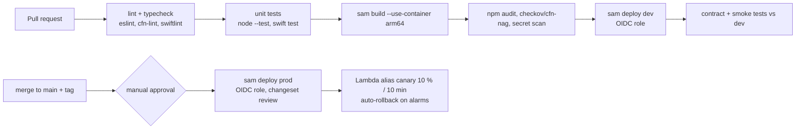

# 11 · AWS Infrastructure & Security

> Infrastructure as code: **AWS SAM** (`backend/template.yaml`, one stack per stage). Logical IDs below are the
> intended names; if the template differs, the template is authoritative and this table should be updated.
> Runtime: Lambda **Node.js 22, arm64**, ESM. Region: one primary region per stage (Bedrock model availability decides — verify `anthropic.claude-opus-5-5` is offered in the chosen region).

## 11.1 Resources

| Logical ID | Type | Key configuration |
|---|---|---|
| `DataKey` | `AWS::KMS::Key` (+ `DataKeyAlias` `alias/healthapp-<stage>-data`) | CMK for DynamoDB tables, S3 bucket, SQS, log groups; rotation on |
| `TokenKey` | `AWS::KMS::Key` (+ alias `alias/healthapp-<stage>-oauth-tokens`) | Envelope encryption of Oura tokens (`tokenCiphertext`); key policy allows `Encrypt/Decrypt` only to Oura-related roles; encryption context `{sub, provider}` required |
| `DataTable` | `AWS::DynamoDB::Table` `HealthAppData` | PK/SK, GSI1 (change feed), GSI2 (sparse Oura user map), on-demand, SSE-KMS `DataKey`, PITR, TTL `expiresAt`, deletion protection (prod) |
| `FoodCatalogTable` | `AWS::DynamoDB::Table` `HealthAppFoodCatalog` | PK/SK, on-demand, TTL `expiresAt`, SSE-KMS, PITR |
| `MediaBucket` | `AWS::S3::Bucket` `healthapp-<stage>-user-media` | SSE-KMS (`DataKey`, bucket key on), Block Public Access, versioning, lifecycle: `users/*/meals/*` expire 30 d unless tag `pinned=true`; `users/*/exports/*` expire 7 d; noncurrent versions expire 7 d; TLS-only + SSE-KMS-required bucket policy; CORS none (presigned PUT from app only) |
| `UserPool` | `AWS::Cognito::UserPool` | No self-signup with password; federated only; deletion protection (prod); advanced security (threat protection) audit mode — verify tier |
| `AppleIdP` | `AWS::Cognito::UserPoolIdentityProvider` `SignInWithApple` | Team ID, Key ID, Services ID; private key from Secrets Manager (dynamic reference); attribute mapping `email`, `sub` |
| `UserPoolClient` | `AWS::Cognito::UserPoolClient` | Public client (no secret), auth code + PKCE, scopes `openid email`, callback `healthapp://auth/callback`, access token 1 h, refresh 30 d, token revocation on |
| `UserPoolDomain` | `AWS::Cognito::UserPoolDomain` | Hosted UI domain (custom domain in prod) |
| `HttpApi` | `AWS::Serverless::HttpApi` | Stage `v1` routes per API §3.3, JWT authorizer (issuer = user pool, audience = client id), default throttle 20 rps / burst 40, access logs (no bodies), CORS off |
| `ProfileFn` … `SyncFn` | `AWS::Serverless::Function` × 6 | `profileFn`, `nutritionFn`, `healthFn`, `aiFn`, `ouraFn`, `syncFn` — HTTP API events per API §3.2; 512 MB (aiFn 1024 MB, 30 s timeout) |
| `OuraWebhookWorker` | Function | SQS event source (`OuraWebhookQueue`), batch 10, partial batch failure reporting |
| `OuraSyncScheduledFn` | Function | EventBridge Scheduler `rate(1 hour)` |
| `NotificationsScheduledFn` | Function | EventBridge Scheduler `rate(15 minutes)` |
| `TombstonePurgeFn` | Function `tombstonePurge` | EventBridge Scheduler `rate(1 day)` — hard-deletes tombstones > 90 d not yet removed by TTL, orphaned S3 photos |
| `OuraWebhookQueue` + `OuraWebhookDLQ` | `AWS::SQS::Queue` ×2 | SSE-KMS, visibility 6× worker timeout, `maxReceiveCount` 5, DLQ retention 14 d |
| Schedules | `AWS::Scheduler::Schedule` ×3 | with dedicated invoke role, flexible window off |
| `OuraSecret`, `FdcApiKeySecret`, `AppleSignInKeySecret`, `ApnsSecret` | `AWS::SecretsManager::Secret` | Oura `{client_id, client_secret, webhook_verification_token}`, USDA FDC key, Apple `.p8` for Cognito IdP, APNs auth key/cert for SNS |
| `ApnsPlatformApplication` | SNS platform application (`APNS` / `APNS_SANDBOX` per stage) | Created by custom resource or one-off script (CloudFormation lacks a native type — verify); endpoints created per `DEVICE#` |
| `ApiWebAcl` (prod) | `AWS::WAFv2::WebACL` + association | AWS managed rule groups: Common, KnownBadInputs, IpReputation, rate-based rule 2,000 req/5 min/IP |
| Log groups | `AWS::Logs::LogGroup` per function | 30-day retention, KMS-encrypted |
| Alarms + `AlarmTopic` | `AWS::CloudWatch::Alarm`, SNS topic | see §11.6 |

## 11.2 IAM least-privilege matrix

All tables/buckets are scoped to this stage's ARNs. `D` = `HealthAppData`, `F` = `HealthAppFoodCatalog`. DynamoDB per-user isolation is enforced in code by key builders (`lib/keys.js`), since Lambda roles act for all users (API §3.5).

| Function | DynamoDB | S3 (`MediaBucket`) | KMS | Secrets | Other |
|---|---|---|---|---|---|
| `profileFn` | D: Get/Put/Update/Delete/Query/BatchWrite (+ GSI1 Query) | `users/*`: List/Get/Put/Delete (export ZIP, delete prefix) | DataKey: Decrypt/GenerateDataKey | OuraSecret: GetSecretValue (revoke on delete) | `cognito-idp:AdminDeleteUser` (pool); `sns:CreatePlatformEndpoint/DeleteEndpoint/SetEndpointAttributes` |
| `nutritionFn` | D: Get/Put/Update/Query; F: Get/Put/Query | — | DataKey: Decrypt/GenerateDataKey | FdcApiKeySecret: Get | outbound HTTPS (FDC, OFF) |
| `healthFn` | D: Get/Put/Update/Query/BatchWrite | — | DataKey | — | — |
| `aiFn` | D: Get/Put/Update/Query (analysis, chat, rate counters, read metrics for coach); F: Get/Query | `users/*/meals/*`: Get; PutObject via presign (`users/*/meals/*`) | DataKey: Decrypt/GenerateDataKey | FdcApiKeySecret: Get | `bedrock:InvokeModel` on `anthropic.claude-opus-5-5` model/inference-profile ARN (API §3.5). The backend calls the Bedrock **Mantle** Messages endpoint (SigV4 service `bedrock-mantle`) — confirm the exact IAM action/resource for that endpoint and grant only it (verify against current AWS docs). **No** TokenKey, no OuraSecret |
| `ouraFn` | D: Get/Put/Update/Delete (OAUTHSTATE, CONNECTION, DAY, WORKOUT), GSI2 Query | — | DataKey; TokenKey: Encrypt/Decrypt (context-bound) | OuraSecret: Get | `sqs:SendMessage` (webhook queue) |
| `syncFn` | D: Get/Put/Update/Query (GSI1) | — | DataKey | — | — |
| `ouraWebhookWorker` | D: Get/Put/Update/Query, GSI2 Query | — | DataKey; TokenKey: Encrypt/Decrypt | OuraSecret: Get | SQS receive/delete (event source) |
| `ouraSyncScheduledFn` | D: Get/Put/Update/Query, GSI2 Scan/Query | — | DataKey; TokenKey: Encrypt/Decrypt | OuraSecret: Get | `sqs:SendMessage` (fan-out) |
| `notificationsScheduledFn` | D: Query/Get/Put (DEVICE, NOTIFLOG, GOALS, MEAL day totals, CONNECTION status) — read-mostly | — | DataKey: Decrypt | ApnsSecret: none (SNS holds creds) | `sns:Publish` to platform endpoints |
| `tombstonePurge` | D: Query/Scan (GSI1)/Delete/BatchWrite | `users/*/meals/*`: List/Delete | DataKey | — | — |

Deploy role (GitHub OIDC): CloudFormation + `iam:PassRole` restricted to the stack's roles; no `*:*`.

## 11.3 Threat model (STRIDE)

| Threat | Example | Controls |
|---|---|---|
| **S**poofing | Forged JWT; fake Oura webhook; OAuth callback CSRF | JWT authorizer validates issuer/audience/signature/expiry; `sub` only from authorizer claims; webhook HMAC-SHA256 + ≤ 5 min skew + constant-time compare; single-use OAuth `state` (10-min TTL) + PKCE; Sign in with Apple nonce via Cognito |
| **T**ampering | Client posts another user's meal; modifies `totals`; uploads non-image to S3 | Keys always built from `sub`; client UUID upserts with `version` conditions; server recomputes totals/nutrients; presigned PUT bound to key + `image/jpeg` + 5 min; server checks JPEG magic bytes and size before Bedrock |
| **R**epudiation | "I didn't delete my data" | Structured audit log events (route, status, hashed `sub`, request id) for deletes/exports/connections; CloudTrail for control plane |
| **I**nformation disclosure | Token leak; logs with health data; prompt containing PII; public bucket; IDOR on photoKey | Tokens KMS-encrypted with separate key + encryption context; logs exclude bodies; prompts contain no identifiers; Block Public Access + TLS-only; photoKey prefix must equal `users//`; Keychain/NSFileProtectionComplete on device; export links 15 min |
| **D**enial of service | Request floods; expensive AI abuse; webhook flood | WAF rate rules (prod); API throttles; AI 30/h/user counter; SQS buffering for webhooks; Lambda reserved concurrency for aiFn and workers; budgets & anomaly detection |
| **E**levation of privilege | Lambda role misuse; prompt injection in photo text; dependency compromise | Per-function least-privilege roles; model has no tools and schema-constrained output; output validated; `npm ci` with lockfile, Dependabot, `npm audit` gate; OIDC short-lived deploy creds; no long-lived keys |

## 11.4 Environments

| | `dev` | `prod` |
|---|---|---|
| Account | separate AWS account (Organizations) | separate account |
| Cognito | dev pool, `healthapp://` callback, test Apple Services ID | prod pool, custom domain |
| APNs | sandbox | production |
| Oura | separate Oura developer app (redirect/webhook URLs per stage) | prod app |
| Data | synthetic + team accounts only | real users |
| Protections | PITR on, deletion protection off, WAF optional | PITR, deletion protection, WAF, termination protection, retain policies on tables/bucket/keys |
| Bedrock | same model id, lower budget alarm | model access enabled + quotas raised |

## 11.5 CI/CD (GitHub Actions)

- **OIDC**: `aws-actions/configure-aws-credentials` assumes `HealthAppDeployRole-<stage>`; trust policy restricted to `repo:<org>/<repo>:ref:refs/heads/main` (prod) / `pull_request` (dev); no stored AWS keys.
- `sam deploy --no-fail-on-empty-changeset --parameter-overrides Stage=<stage>`; secrets values never in parameters (set out-of-band).
- iOS: separate workflow on macOS runners (XcodeGen, `xcodebuild test`, TestFlight upload via App Store Connect API key in GitHub secrets — environments-protected).
- Nightly: AI eval suite (doc 07 §7.10) with budget cap; Oura OpenAPI contract diff.

## 11.6 Observability

- **Logs**: JSON structured logger (`lib/logger.js`): `level, ts, requestId, route, status, latencyMs, subHash (HMAC-SHA256 with a log salt), errorCode`; **no request/response bodies, tokens, photos, prompts or model output**. 30-day retention.
- **Metrics** (Embedded Metric Format): per-route latency/errors; `AiCalls`, `AiRefusals`, `AiMaxTokens`, `AiInputTokens`, `AiOutputTokens`, `AiCacheReadTokens`; `OuraWebhookReceived/Invalid`, `OuraSyncUsers`, `OuraRateLimited`, `OuraReauthRequired`; `SyncConflicts`; `PushSent/Failed`.
- **Tracing**: X-Ray (active tracing on Lambdas, 5 % sampling in prod), AWS SDK instrumented; no annotations with PII.
- **Alarms** (→ `AlarmTopic` → email/pager): API 5xx > 1 % for 5 min; p95 latency > 1 s (non-AI) / > 15 s (AI); any message in `OuraWebhookDLQ`; Lambda throttles > 0; Oura error rate > 5 %; Bedrock refusals > 5 % or errors > 2 %; DynamoDB throttles; KMS decrypt failures; budget 80 %/100 % (AWS Budgets) and Cost Anomaly Detection.
- **Dashboards**: API health, AI cost/latency, Oura pipeline, sync health.

## 11.7 Backup & disaster recovery

| Asset | Mechanism | RPO / RTO |
|---|---|---|
| `HealthAppData` | PITR (35 days) + deletion protection; optional AWS Backup daily copy to a second region (prod) | RPO ≤ 5 min (PITR) / RTO ≤ 4 h (restore to new table + switch name via parameter) |
| `HealthAppFoodCatalog` | PITR; reconstructible from USDA | RPO n/a / RTO ≤ 1 h |
| `MediaBucket` | Versioning (noncurrent 7 d); photos are ephemeral by design (30 d) | best effort |
| KMS keys | `DeletionPolicy: Retain`, 30-day pending window | — |
| Cognito | Users re-created on next Sign in with Apple (same Apple `sub` → but new Cognito `sub`!) — **mitigation**: keep a `appleSub → cognitoSub` mapping export, and never delete the pool (deletion protection) | — |
| IaC | Entire stack reproducible from git | RTO ≤ 2 h for a fresh region (minus data restore) |

Restores honour deletions: after any restore, replay the account-deletion log (deleted `sub`s, kept 35 days) so erased users are not resurrected (GDPR).

## 11.8 Cost estimate (rough)

**Estimates only — assumptions below; verify all unit prices against current AWS pricing for the chosen region (Bedrock pricing for Claude Opus 5.5 especially).**

Assumptions per MAU per month: 50 API requests/day active, 20 active days → ~1,000 requests; 15 photo analyses, 10 coach messages, 5 voice parses; 50 % of users connect Oura (hourly pull ≈ 6 Oura calls/h, batched); DynamoDB ≈ 3,000 write units and 10,000 read units; 12 MB of photos retained on average; Lambda 512 MB × 200 ms average. AI cost per photo ≈ $0.03–0.06 and per coach turn ≈ $0.02–0.04 at Anthropic list prices ($4 / $20 per MTok) — Bedrock prices may differ.

| Service (monthly) | 1k MAU | 10k MAU | 100k MAU |
|---|---|---|---|
| API Gateway HTTP API ($1/M req) | $1 | $10 | $100 |
| Lambda (arm64, incl. Oura pulls) | $5 | $45 | $450 |
| DynamoDB on-demand + storage + PITR | $5 | $45 | $450 |
| S3 storage + requests | $1 | $5 | $40 |
| KMS (3 keys + requests, with data-key caching) | $5 | $15 | $100 |
| Cognito (≤ 10k MAU free on lower tiers, then per-MAU — verify tier) | $0 | $0 | $250–1,350 |
| CloudWatch logs/metrics/alarms, X-Ray | $10 | $50 | $400 |
| Secrets Manager, SQS, SNS, Scheduler | $3 | $5 | $20 |
| WAF (prod) | $15 | $20 | $80 |
| **Infra subtotal** | **≈ $45** | **≈ $195** | **≈ $1.9k–3k** |
| **Bedrock (Claude) — dominant** | **≈ $0.6k–1.3k** | **≈ $6k–13k** | **≈ $60k–130k** |
| **Total** | ≈ $0.7k–1.4k | ≈ $6k–13k | ≈ $62k–133k |
| **Per MAU** | ≈ $0.7–1.4 | ≈ $0.6–1.3 | ≈ $0.6–1.3 |

Levers if AI cost exceeds targets: effort `low` where eval allows, prompt caching (system prompt), photo-hash result cache, tighter per-user daily caps for free tier, batch non-interactive work (weekly insights) via Bedrock batch inference, shorter coach context windows, cache common USDA lookups (already in `HealthAppFoodCatalog`).
